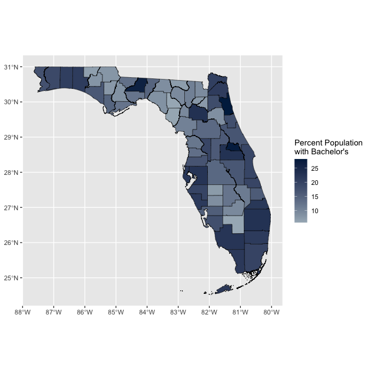
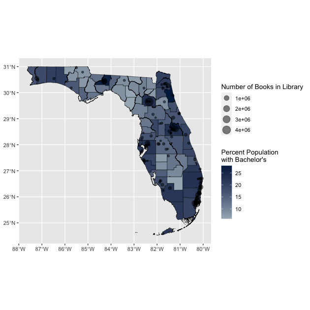
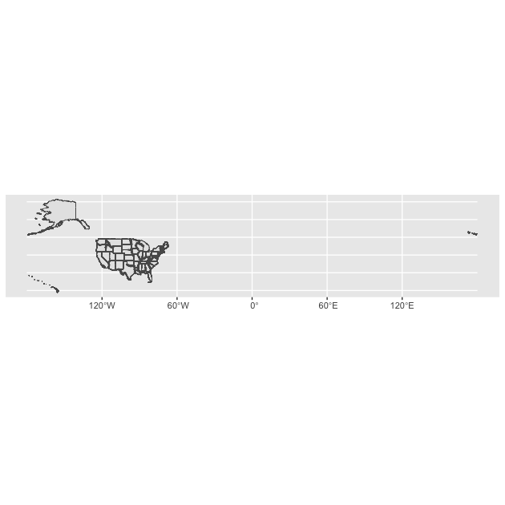
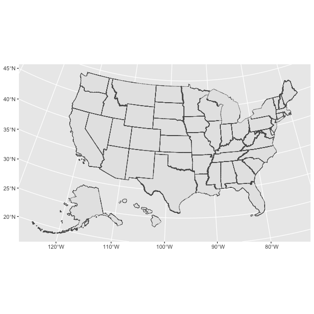
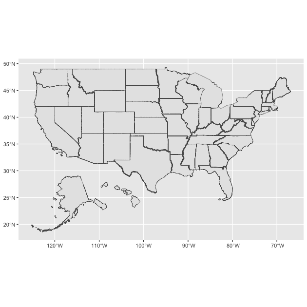
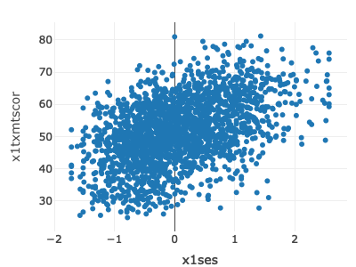

_Note from BS: This lesson was written and taught by guest lecturer,
Matt Capaldi, University of Florida PhD student and course TA for
Spring 2023. I'm very excited to share this space with others!_

In today's lesson we are going to learn how to make basic maps in a
template/format that is highly applicable for educational
research. Along the way, we are also going to touch on using
Application Programming Interfaces (APIs) in R and some very
fundamental aspects of spatial data.

For today's lesson we will need `tidyverse`, `sf` (a package that
handles spatial data), `tidycensus` (a package that downloads census
data and some spatial data), and `tigris` (a package that downloads
additional spatial data and can make some key spatial
transformations). 

We already have `tidyverse`, so be sure to install the others if you
don't have them already:

```r
install.packages(c("sf", "tidycensus", "tigris"))
```


```r
## ---------------------------
## libraries
## ---------------------------
library(tidyverse)
```

```
## ── Attaching core tidyverse packages ──────────────────────── tidyverse 2.0.0 ──
## ✔ dplyr     1.1.1     ✔ readr     2.1.4
## ✔ forcats   1.0.0     ✔ stringr   1.5.0
## ✔ ggplot2   3.4.2     ✔ tibble    3.2.1
## ✔ lubridate 1.9.2     ✔ tidyr     1.3.0
## ✔ purrr     1.0.1     
## ── Conflicts ────────────────────────────────────────── tidyverse_conflicts() ──
## ✖ dplyr::filter() masks stats::filter()
## ✖ dplyr::lag()    masks stats::lag()
## ℹ Use the conflicted package (<http://conflicted.r-lib.org/>) to force all conflicts to become errors
```

```r
library(sf)
```

```
## Linking to GEOS 3.11.2, GDAL 3.6.3, PROJ 9.2.0; sf_use_s2() is TRUE
```

```r
library(tidycensus)
library(tigris)
```

```
## To enable caching of data, set `options(tigris_use_cache = TRUE)`
## in your R script or .Rprofile.
```

Our data directory path will be the same as we've used throughout the
course.


```r
## ---------------------------
## directory paths
## ---------------------------

## assume we're running this script from the ./scripts subdirectory
dat_dir <- file.path("..", "data")
```

# Reading in Data

One of the great advantages of using APIs for mapping is that we
download spatial data directly into R instead of having to download
and handle these quite large files through our computer. If we weren't
using an API or wanted to plot some spatial data not available through
one, we would need to find and download a shapefile folder containing
a selection of files, then read in the one ending in `*.shp` ---
something like this below:


```r
## ---------------------------
## example of shapefile read
## ---------------------------

## pseudo code (won't run!)
df <- read_sf(file.path("<Folder-You-Downloaded>", "<Shapefile-Name>.shp"))
```

These shapefiles can sometimes be hard to find, take up a lot of space
on our computer (especially if they are overly detailed for our
needs), and make it much harder to share our project with others for
reproducibility. That is why we are going to use an API.

# Setting up APIs and tidycensus

So what exactly is an API? In short, think of it as a way of R going
to a website/database and pulling data directly from the server-side
or backend, without our having to ever interact with the website
directly. (**Note from BS: we avoid point-click at all costs!**) We
are going to use the API tidycensus today, but all [APIs
operate](https://en.wikipedia.org/wiki/API) on the same basic idea.

Tidycensus is, in my opinion, one of the easiest APIs to get set up
and use in R. Most APIs require that you use some kind of _key_ that
identifies you as an authorized user. Typically you need to set up the
key the first time you use the API, but helpfully, it's usually
possible to store the key on your computer for all future use (think
of the way we initially set up GitHub and then it worked without
needing to go through that process again --- the good news is that API
keys are _way_ easier to set up). Most keys are free to obtain and
use. If you were using an API to access a private database such as
Google Maps, you might need to pay for your key to have access or on a
sliding scale depending on how much you use it. But because we are
using Census data, which is freely available to the public, there's no
charge.

Hopefully, most of you were able to get your Census API key before
class, but if anyone needs a reminder, 

1. [simply go here](http://api.census.gov/data/key_signup.html)
1. enter your organization name (University of Florida)
1. enter your email. 

You will quickly receive an email with your API key, which you will
need below.

To set up tidycensus for the first time, we first need to set our API
key. The tidycensus library makes this much easier than many APIs by
having a built-in function that you can use to save your API key to
your computer. Simply place your API key in the `<>` of the code
below. The install option means it will save the API key for future
use, so you will not need to worry about this step again.


```r
## ---------------------------
## set API key
## ---------------------------

## you only need to do this once: replace everything between the
## quotes with the key in the email you received
##
## eg. census_api_key("XXXXXXXXXXXXXXXXXX", install = T)
census_api_key("<Your API Key Here>", install = T)
```
Now that this is set up, we are ready to start using tidycensus --- yay!

# Reading in data with tidycensus

There are five main tidycensus functions that you can use to call in
data, with each calling data from a different source operated by the
[US Census Bureau](https://www.census.gov). For today's lesson we are
going to use `get_acs()`, which collects data from the [American
Community Survey](https://www.census.gov/programs-surveys/acs)
(regular sampled surveys of demographic data across the US). There are
a selection of other functions to collect data from different sources
within the Census; the most useful ones for us start with `get_`. You
can see [more info
here](https://walker-data.com/tidycensus/reference/index.html).

We are going to assign `<-` the data we pull down into the object
`df_census`:


```r
## ---------------------------
## first data pull
## ---------------------------

df_census <- get_acs(geography = "county",
                     state = "FL",
                     year = 2021,
                     variables = "DP02_0065PE", # Pop >=25 with Bachelors
                     output = "wide",
                     geometry = TRUE)
```

```
## Getting data from the 2017-2021 5-year ACS
```

```
## Downloading feature geometry from the Census website.  To cache shapefiles for use in future sessions, set `options(tigris_use_cache = TRUE)`.
```

```
## Using the ACS Data Profile
```

Let's walk through each element of this command in turn:

- `geography = "county"` is telling the function to get estimates (and
  spatial data later) at the county level; this could also be
  `"state"`, for example, to get state level data.  
- `state = "FL"` is telling the function to get data only for the
  state of Florida. You could put a group of states with `c()`, use
  full state names, or use [FIPS
  codes](https://en.wikipedia.org/wiki/Federal_Information_Processing_Standards)
  --- tidycensus is flexible. If you want a narrower set of data, you
  could also add `county =`, which works in a similar way. For
  example, if you added `county = "Alchua"`, you would only get
  county-level data for Alachua County, Florida.
- `year = 2021` is telling the function to pull data for the survey
  year 2021. For ACS, this will be the survey set ending in that
  year. Keep in mind that some data are not available for every
  year. For example, data from the full decennial census are only
  available for 2010 or 2020.
- `variables = "DP02_0065PE"` is telling the function to pull the
  variable coded `"DP02_0065PE"`, which is the percentage of the
  population older than 25 with a Bachelor's degree. This is the only
  tricky part of using tidycensus: understanding census API's variable
  names. Let me breakdown what we are calling here:
  - `DP02_0065`
    - This is the main variable code the census uses. You _can_ call
    this by using the `load_variables()` command, but doing so creates
    a massive table in R that is hard to navigate through. An easier
    way is to go the census API's list of variables for the dataset
    you are using, which for the [2021 ACS is
    here](https://api.census.gov/data/2021/acs/acs5/profile/variables.html)
    (change the years/data sources as needed for other surveys).
    - In here you can `crtl-f` or `cmd-f` search for the variable you
      are looking for. For this variable we could search "bachelor,"
      which will highlight all the variables that have "bachelor" in
      the title. Find the variable you want and copy the name.
  - `PE`
    - You will notice there are multiple `DP02_0065` variables, these
      are the same underlying variable, but in different forms. The
      common endings are `E` or `PE`, which stand for _Estimate_ and
      _Percentage Estimate_. For our purposes, we are most often going
      to want the percentage estimate (PE), so we will select
      `DP02_0065PE`, the percent estimate of Bachelor's degree
      attainment for those 25 years old and above, and `DP02_0065PM`
      which is the margin of error for the percentage (hence the `M`
      at the end). If you want the total count instead, select `E`.
- `output = "wide"` is telling it we want the data in a wide
  format. Think back to [Data Wrangling
  II](../lessons/dw_two.html): _wide data_ means having a
  separate column for each variable whereas _long data_ would be in
  two columns, one with the variable name and one with the variable
  value. For ease of plotting/mapping, we are going to want it in wide
  format.
- `geometry = T` is telling the function we want to download geometry
  (a kind of spatial data) to go with our census data. This saves us
  having to deal with finding, loading, and joining a shapefile to
  make our map. We will discuss this more shortly.

Okay, let see what the top of our new data looks like.


```r
## show header of census data
head(df_census)
```

```
## Simple feature collection with 6 features and 4 fields
## Geometry type: MULTIPOLYGON
## Dimension:     XY
## Bounding box:  xmin: -82.57599 ymin: 27.64324 xmax: -80.73292 ymax: 30.14312
## Geodetic CRS:  NAD83
##   GEOID                    NAME DP02_0065PE DP02_0065PM
## 1 12095  Orange County, Florida        23.0         0.6
## 2 12125   Union County, Florida         7.6         2.1
## 3 12069    Lake County, Florida        16.0         0.9
## 4 12127 Volusia County, Florida        16.8         0.5
## 5 12105    Polk County, Florida        14.0         0.5
## 6 12119  Sumter County, Florida        19.4         1.4
##                         geometry
## 1 MULTIPOLYGON (((-81.65856 2...
## 2 MULTIPOLYGON (((-82.57599 2...
## 3 MULTIPOLYGON (((-81.95616 2...
## 4 MULTIPOLYGON (((-81.6809 29...
## 5 MULTIPOLYGON (((-82.10621 2...
## 6 MULTIPOLYGON (((-82.31133 2...
```

It looks a bit different than a normal data frame. For now, let's not
worry too much about the first few lines which give a summary of the
spatial aspects of the our downloaded data. If you look underneath
those lines, from `GEOID` to `DP02_0065PM`, you'll see something that
looks more like the tibbles we are familiar with. Then, in the last
column, we get to our spatial data in the `geometry` column. If you
open `df_census` in the viewer, it looks like a normal data frame
ending with this slightly different column called `geometry`.

**Note:** I wouldn't recommend often looking through the file in
viewer as the the spatial data can make it slow/laggy. If you need to
dig into the data that way, use `st_drop_geometry()` and assign it to
a new object.


```r
## view data frame without geometry data (not assigning, just viewing)
df_census %>%
  st_drop_geometry()
```

```
##    GEOID                         NAME DP02_0065PE DP02_0065PM
## 1  12095       Orange County, Florida        23.0         0.6
## 2  12125        Union County, Florida         7.6         2.1
## 3  12069         Lake County, Florida        16.0         0.9
## 4  12127      Volusia County, Florida        16.8         0.5
## 5  12105         Polk County, Florida        14.0         0.5
## 6  12119       Sumter County, Florida        19.4         1.4
## 7  12073         Leon County, Florida        26.7         0.9
## 8  12047     Hamilton County, Florida         6.9         1.6
## 9  12093   Okeechobee County, Florida        11.3         1.4
## 10 12071          Lee County, Florida        17.8         0.5
## 11 12001      Alachua County, Florida        23.2         1.0
## 12 12077      Liberty County, Florida         8.3         2.6
## 13 12097      Osceola County, Florida        16.5         0.9
## 14 12123       Taylor County, Florida         8.3         2.1
## 15 12013      Calhoun County, Florida         7.5         2.0
## 16 12037     Franklin County, Florida        12.2         2.5
## 17 12029        Dixie County, Florida         5.9         1.9
## 18 12133   Washington County, Florida         7.9         1.4
## 19 12129      Wakulla County, Florida        12.2         2.2
## 20 12131       Walton County, Florida        21.1         1.6
## 21 12007     Bradford County, Florida         7.3         1.6
## 22 12031        Duval County, Florida        21.0         0.6
## 23 12033     Escambia County, Florida        17.4         0.8
## 24 12089       Nassau County, Florida        20.5         1.4
## 25 12009      Brevard County, Florida        19.5         0.6
## 26 12086   Miami-Dade County, Florida        19.8         0.3
## 27 12053     Hernando County, Florida        12.9         0.6
## 28 12107       Putnam County, Florida         8.6         1.2
## 29 12023     Columbia County, Florida        10.6         1.1
## 30 12049       Hardee County, Florida         7.2         1.8
## 31 12017       Citrus County, Florida        11.9         0.9
## 32 12117     Seminole County, Florida        27.7         0.8
## 33 12039      Gadsden County, Florida        12.8         1.4
## 34 12045         Gulf County, Florida        14.6         2.8
## 35 12121     Suwannee County, Florida         9.3         1.8
## 36 12065    Jefferson County, Florida        14.5         2.2
## 37 12075         Levy County, Florida        10.5         1.6
## 38 12057 Hillsborough County, Florida        22.5         0.4
## 39 12103     Pinellas County, Florida        22.0         0.5
## 40 12083       Marion County, Florida        13.8         0.8
## 41 12055    Highlands County, Florida        12.2         1.0
## 42 12027       DeSoto County, Florida         8.8         1.3
## 43 12113   Santa Rosa County, Florida        18.8         1.1
## 44 12079      Madison County, Florida         8.8         1.8
## 45 12041    Gilchrist County, Florida         9.4         1.7
## 46 12087       Monroe County, Florida        21.7         1.3
## 47 12111    St. Lucie County, Florida        15.9         0.8
## 48 12109    St. Johns County, Florida        28.1         1.1
## 49 12003        Baker County, Florida         9.2         2.2
## 50 12035      Flagler County, Florida        17.8         1.1
## 51 12051       Hendry County, Florida         5.8         1.4
## 52 12091     Okaloosa County, Florida        20.7         1.0
## 53 12005          Bay County, Florida        16.4         1.0
## 54 12099   Palm Beach County, Florida        23.0         0.4
## 55 12011      Broward County, Florida        21.2         0.4
## 56 12021      Collier County, Florida        22.4         0.8
## 57 12081      Manatee County, Florida        19.6         0.6
## 58 12085       Martin County, Florida        21.9         1.1
## 59 12043       Glades County, Florida         9.5         2.5
## 60 12067    Lafayette County, Florida         5.8         2.9
## 61 12063      Jackson County, Florida         7.8         1.1
## 62 12015    Charlotte County, Florida        15.5         0.9
## 63 12059       Holmes County, Florida         6.6         1.7
## 64 12101        Pasco County, Florida        16.9         0.5
## 65 12019         Clay County, Florida        18.2         1.1
## 66 12115     Sarasota County, Florida        21.4         0.6
## 67 12061 Indian River County, Florida        19.4         1.3
```

# A (Very) Brief Overview of Spatial Data

We do not have time to really get into all the complexities of spatial
data in this class, so, unfortunately, it will have to remain a bit of
black box for now. But below is a quick overview of how R handles it.

As we saw above, there is a column on the end of our data called
`geometry`. This is not technically a column like we are used to; for
example, you can't `select(geometry)` or `filter(geometry == x)` like
we do with other variables in our data frames. Instead, think of it as
a special attachment R places on each observation.

## Vectors vs Rasters

When looking online for spatial data, you might see how spatial data
can be either in _vector_ or _raster_ format. For our purposes,
everything is going to be vector, which is kind of like a vector in R:
collection of data points that represent something spatial. Raster
data, on the other hand, is a grid with information assigned to each
square, commonly used for satellite imagery analysis.

- **Vector**: here's instructions (e.g., a formula) to draw a line;
  great for animations and things like maps and scales well
- **Raster**: here's a big paint-by-numbers grid and the line you see
  is where some squares are filled in; great for photographic images,
  but doesn't scale well

Vector data are usually either as points (think dots on a map), lines
(think a line connecting two points on a map), or polygons (think a
collection of lines on a map that create a closed shape). In this
lesson we are going to use both point and polygon data (you won't use
line data as much). If this sounds complicated, fear not! It is much
simpler than it sounds right now!

For those interested, this is a [nice intro to the types of spatial
data](https://www.gislounge.com/geodatabases-explored-vector-and-raster-data/).

## Coordinate Reference Systems (CRS)

For purposes of this lesson, the only internal workings of spatial
data we need to be aware of is something called the Coordinate
Reference System or CRS. Our earth is not flat, but rather is a curved
three-dimensional object (**NB from BS: [this is most likely
true](https://en.wikipedia.org/wiki/Modern_flat_Earth_beliefs)**). Since
we don't want to carry around globes, we take this 3D object and
squish it into two dimensions on a map. This process necessarily
involves some kind of transformation, compromise, or projection. 

In a nutshell, this is _a very simplified explanation of what a CRS
decides_: it's _*how*_ we are deciding to twist, pull, squish a 3D
Earth surface into a flat surface. Turns out this matters _a lot_. Do
you want your results to have the correct areas? Or maybe correct
distances? Or maybe straight lines of bearing (particularly important
if you are [sailing and don't want those trips to take any longer than
necessary](https://en.wikipedia.org/wiki/Mercator_projection)).

Here's a (somewhat old) [pop culture look at this
issue](https://www.youtube.com/watch?v=vVX-PrBRtTY).

This is a relatively complicated process we are not going to go into
here. If you're interested here's a [nice introduction to
CRS](https://docs.qgis.org/2.8/en/docs/gentle_gis_introduction/coordinate_reference_systems.html)
by QGIS.

For our class we are going to use the CRS *ESPG 4326*, which is in
essence a projection that makes east/west run straight left/right and
north/south run straight up/down. All different CRS have their
advantages and disadvantages. This is nice and simple for quick
descriptive maps, but distorts shapes in ways that might be harmful,
particularly if you are going to do any distance calculations, _etc_.

**NB from BS:** _If you are going to do spatial work in education
research (other than just making maps for display), you **really**
need to know what your projection is doing. Even if you are just
making maps for display, some projections are, IMNSHO, more
aesthetically pleasing that others in different situations. I
personally will tell you if your map offends the dictates of good
taste._

Keep an eye out for `crs = 4326` as we go through some examples
plotting spatial data below.

In short, what you need to know about spatial data for this lesson is
this:

- R stores spatial data in something called `geometry` attached to each
  observation/row
- To handle spatial data, you can't just `filter()` it like normal;
  instead you have to use functions from a spatial data package
  such as `sf` or `tigris`
- The CRS (coordinate reference system) is how we choose to account
  for the earth being curved; what is most important for mapping is
  that everything we use on the plot is using the same CRS. Using `crs
  = 4326` will give a nice simple flat projection. This projection has
  drawbacks, but is easy to work with and so is what we will use for
  now.

# Let's Make a Map (finally)!

If we have made it this far, things are about to get much more
interesting and hands-on!

We are going to make an education-focused map based on template I used
for a real consulting project last summer as part of my GA-ship. This
template is really adaptable for a lot the kind of maps we might want
educational research and reports. So let's get started.

We are going to have two layers, a base map with the census data we
already downloaded, and a layer of points on top representing
colleges.

## Layer One: Base Map

Before we plot anything, particularly since we are going to have
multiple layers, we want to check our CRS


```r
## ---------------------------------------------------------
## making a map
## ---------------------------------------------------------
## ---------------------------
## layer one: base map
## ---------------------------

## show CRS for dataframe
st_crs(df_census)
```

```
## Coordinate Reference System:
##   User input: NAD83 
##   wkt:
## GEOGCRS["NAD83",
##     DATUM["North American Datum 1983",
##         ELLIPSOID["GRS 1980",6378137,298.257222101,
##             LENGTHUNIT["metre",1]]],
##     PRIMEM["Greenwich",0,
##         ANGLEUNIT["degree",0.0174532925199433]],
##     CS[ellipsoidal,2],
##         AXIS["latitude",north,
##             ORDER[1],
##             ANGLEUNIT["degree",0.0174532925199433]],
##         AXIS["longitude",east,
##             ORDER[2],
##             ANGLEUNIT["degree",0.0174532925199433]],
##     ID["EPSG",4269]]
```

That isn't our simple flat ESPG 4326, so we are going to
`st_transform()` to set that.


```r
## transform the CRS to 4326
df_census <- df_census %>%
  st_transform(crs = 4326)
```

Then we can check again...


```r
## show CRS again; notice how it changed from NAD93 to ESPG:4326
st_crs(df_census) 
```

```
## Coordinate Reference System:
##   User input: EPSG:4326 
##   wkt:
## GEOGCRS["WGS 84",
##     ENSEMBLE["World Geodetic System 1984 ensemble",
##         MEMBER["World Geodetic System 1984 (Transit)"],
##         MEMBER["World Geodetic System 1984 (G730)"],
##         MEMBER["World Geodetic System 1984 (G873)"],
##         MEMBER["World Geodetic System 1984 (G1150)"],
##         MEMBER["World Geodetic System 1984 (G1674)"],
##         MEMBER["World Geodetic System 1984 (G1762)"],
##         MEMBER["World Geodetic System 1984 (G2139)"],
##         ELLIPSOID["WGS 84",6378137,298.257223563,
##             LENGTHUNIT["metre",1]],
##         ENSEMBLEACCURACY[2.0]],
##     PRIMEM["Greenwich",0,
##         ANGLEUNIT["degree",0.0174532925199433]],
##     CS[ellipsoidal,2],
##         AXIS["geodetic latitude (Lat)",north,
##             ORDER[1],
##             ANGLEUNIT["degree",0.0174532925199433]],
##         AXIS["geodetic longitude (Lon)",east,
##             ORDER[2],
##             ANGLEUNIT["degree",0.0174532925199433]],
##     USAGE[
##         SCOPE["Horizontal component of 3D system."],
##         AREA["World."],
##         BBOX[-90,-180,90,180]],
##     ID["EPSG",4326]]
```

Looks good!

Okay, with our CRS now set, let's plot our base map. We actually use
the familiar `ggplot()` to make our maps because there is a special
`geom_*` that works with spatial data: `geom_sf()`. Everything works
in a similar way to our normal plots, so this should be
familiar. Luckily all the tricky spatial aspects are handled by ggplot
for us.

The below code will make our base map, and store in an object called
`base_map`.


```r
## create base map
base_map <- ggplot() +
  geom_sf(data = df_census,
          aes(fill = DP02_0065PE),
          color = "black",
          size = 0.1) +
  labs(fill = str_wrap("Percent Population with Bachelor's", 20)) +
  scale_fill_gradient(low = "#a6b5c0", high = "#00254d")
```

Let's go through each line of the `geom_sf()` as we did for `get_acs()` above:

- `data = df_census`: all we need to do take make our spatial plot is
  call a data frame with a geometry attachment. `geom_sf()` will handle
  how to plot that for us.
- `aes(fill = DP02_0065PE)`: much like we would with a box plot, we are
  simply telling ggplot to fill the shapes (in our case, Florida's
  counties) based on that variable. So here we are filling Florida's
  counties based on the percent of the population over 25 with a
  Bachelor's degree (the variable we chose from tidycensus)
- `color = "black"`: remember since this is outside the `aes()`
  argument it will applied consistenly across the plot. We are
  telling it to make all the lines black.
- `size = 0.1`: similarly, we are telling to make the lines 0.1
  thickness (thinner than the default)

Then we have added two visual alterations like we covered in the
[second plotting lesson](../lessons/plotting_ii.html). For a
quick reminder:

- `labs(fill = str_wrap("Percent Population with Bachelor's", 20))` is
  saying to give the legend for `fill` this title; a new function,
  `str_wrap()` says to make a newline (wrap) when there are more than
  20 characters
- `scale_fill_gradient(low = "#a6b5c0", high = "#00254d")` is telling `fill`
  with a color gradient starting at with light slate blue and
  finishing with a dark slate blue; instead of colour names, we're
  using [hex color codes](https://en.wikipedia.org/wiki/Web_colors)

Now, let's call our `base_map` object to see what this looks like


```r
## call base map by itself
base_map
```



We have made a map! But we are going to add one more layer.

## Layer Two: Institution Points

A lot of education data comes with a latitude and longitude for the
institution. Today we are going to use IPEDS, but you can certainly
get these for K-12 schools and a whole lot more besides.

We are now going to read in some library data from IPEDS that I
cleaned and merged earlier.


```r
## ---------------------------
## layer two: institutions
## ---------------------------

## read in IPEDS data
df_ipeds <- read_csv(file.path(dat_dir, "mapping_api_data.csv"))
```

```
## Rows: 3764 Columns: 78
## ── Column specification ────────────────────────────────────────────────────────
## Delimiter: ","
## chr (35): INSTNM, STABBR, COUNTYNM, XLPBOOKS, XLEBOOKS, XLEDATAB, XLPMEDIA, ...
## dbl (43): UNITID, CONTROL, ICLEVEL, FIPS, COUNTYCD, LATITUDE, LONGITUD, LEXP...
## 
## ℹ Use `spec()` to retrieve the full column specification for this data.
## ℹ Specify the column types or set `show_col_types = FALSE` to quiet this message.
```

Let's take a look at our data


```r
## show IPEDS data
head(df_ipeds)
```

```
## # A tibble: 6 × 78
##   UNITID INSTNM CONTROL ICLEVEL STABBR  FIPS COUNTYNM COUNTYCD LATITUDE LONGITUD
##    <dbl> <chr>    <dbl>   <dbl> <chr>  <dbl> <chr>       <dbl>    <dbl>    <dbl>
## 1 100654 Alaba…       1       1 AL         1 Madison…     1089     34.8    -86.6
## 2 100663 Unive…       1       1 AL         1 Jeffers…     1073     33.5    -86.8
## 3 100690 Amrid…       2       1 AL         1 Montgom…     1101     32.4    -86.2
## 4 100706 Unive…       1       1 AL         1 Madison…     1089     34.7    -86.6
## 5 100724 Alaba…       1       1 AL         1 Montgom…     1101     32.4    -86.3
## 6 100751 The U…       1       1 AL         1 Tuscalo…     1125     33.2    -87.5
## # ℹ 68 more variables: LEXP100K <dbl>, LCOLELYN <dbl>, XLPBOOKS <chr>,
## #   LPBOOKS <dbl>, XLEBOOKS <chr>, LEBOOKS <dbl>, XLEDATAB <chr>,
## #   LEDATAB <dbl>, XLPMEDIA <chr>, LPMEDIA <dbl>, XLEMEDIA <chr>,
## #   LEMEDIA <dbl>, XLPSERIA <chr>, LPSERIA <dbl>, XLESERIA <chr>,
## #   LESERIA <dbl>, XLPCOLLC <chr>, LPCLLCT <dbl>, XLECOLLC <chr>,
## #   LECLLCT <dbl>, XLTCLLCT <chr>, LTCLLCT <dbl>, XLPCRCLT <chr>,
## #   LPCRCLT <dbl>, XLECRCLT <chr>, LECRCLT <dbl>, XLTCRCLT <chr>, …
```

We see a normal data frame for colleges with bunch of variables (use
the IPEDS codebook to unpack the variable names), including latitude
and longitude. Latitude and longitude represent something spatial, but
they're not quite _spatial data_ like R knows. Let's change that!


```r
## convert coordinates columns into a true geometry column; this is
## much more reliable than simply plotting them as geom_points as it
## ensures the CRS matches etc.
df_ipeds <- df_ipeds %>% 
  st_as_sf(coords = c("LONGITUD", "LATITUDE"))
```

Above we call `st_as_sf()`, then tell it the coordinates, `coords =`,
are in columns name `LONGITUD` and `LATITUDE`. If we aren't using
argument names (we aren't) just remember that since longitude tells
you were you are east/west on the globe, it translates to the `x`
axis. Because latitude gives you north/south direction, it translates
to the `y` axis.

If we look at our data again, we are going to see that spatial summary
again as R has attached some point geometry to our college data based
on the coordinates.


```r
## show IPEDS data again
head(df_ipeds)
```

```
## Simple feature collection with 6 features and 76 fields
## Geometry type: POINT
## Dimension:     XY
## Bounding box:  xmin: -87.54598 ymin: 32.36261 xmax: -86.17401 ymax: 34.78337
## CRS:           NA
## # A tibble: 6 × 77
##   UNITID INSTNM CONTROL ICLEVEL STABBR  FIPS COUNTYNM COUNTYCD LEXP100K LCOLELYN
##    <dbl> <chr>    <dbl>   <dbl> <chr>  <dbl> <chr>       <dbl>    <dbl>    <dbl>
## 1 100654 Alaba…       1       1 AL         1 Madison…     1089        1        2
## 2 100663 Unive…       1       1 AL         1 Jeffers…     1073        1        2
## 3 100690 Amrid…       2       1 AL         1 Montgom…     1101        1        2
## 4 100706 Unive…       1       1 AL         1 Madison…     1089        1        2
## 5 100724 Alaba…       1       1 AL         1 Montgom…     1101        1        2
## 6 100751 The U…       1       1 AL         1 Tuscalo…     1125        1        2
## # ℹ 67 more variables: XLPBOOKS <chr>, LPBOOKS <dbl>, XLEBOOKS <chr>,
## #   LEBOOKS <dbl>, XLEDATAB <chr>, LEDATAB <dbl>, XLPMEDIA <chr>,
## #   LPMEDIA <dbl>, XLEMEDIA <chr>, LEMEDIA <dbl>, XLPSERIA <chr>,
## #   LPSERIA <dbl>, XLESERIA <chr>, LESERIA <dbl>, XLPCOLLC <chr>,
## #   LPCLLCT <dbl>, XLECOLLC <chr>, LECLLCT <dbl>, XLTCLLCT <chr>,
## #   LTCLLCT <dbl>, XLPCRCLT <chr>, LPCRCLT <dbl>, XLECRCLT <chr>,
## #   LECRCLT <dbl>, XLTCRCLT <chr>, LTCRCLT <dbl>, LILLDYN <dbl>, …
```

But then look at our CRS: it's `NA`! This means R will not be able to
turn that data into a map. Basically, R knows we have spatial data,
but it doesn't know how we want to put onto a 2D surface (how to
project it). To be sure, let's check the CRS directly:


```r
## check CRS for IPEDS data
st_crs(df_ipeds)
```

```
## Coordinate Reference System: NA
```

Still `NA`...

Luckily the fix for this is similar to how we change the CRS for our
earlier map.


```r
## add CRS to our IPEDS data
df_ipeds <- df_ipeds %>% 
  st_set_crs(4326) # When you first add coordinates to geometry, it doesn't know
                   # what CRS to use, so we set to 4326 to match our base map data
```

Okay, let's have another look...


```r
## check CRS of IPEDS data again
st_crs(df_ipeds)
```

```
## Coordinate Reference System:
##   User input: EPSG:4326 
##   wkt:
## GEOGCRS["WGS 84",
##     ENSEMBLE["World Geodetic System 1984 ensemble",
##         MEMBER["World Geodetic System 1984 (Transit)"],
##         MEMBER["World Geodetic System 1984 (G730)"],
##         MEMBER["World Geodetic System 1984 (G873)"],
##         MEMBER["World Geodetic System 1984 (G1150)"],
##         MEMBER["World Geodetic System 1984 (G1674)"],
##         MEMBER["World Geodetic System 1984 (G1762)"],
##         MEMBER["World Geodetic System 1984 (G2139)"],
##         ELLIPSOID["WGS 84",6378137,298.257223563,
##             LENGTHUNIT["metre",1]],
##         ENSEMBLEACCURACY[2.0]],
##     PRIMEM["Greenwich",0,
##         ANGLEUNIT["degree",0.0174532925199433]],
##     CS[ellipsoidal,2],
##         AXIS["geodetic latitude (Lat)",north,
##             ORDER[1],
##             ANGLEUNIT["degree",0.0174532925199433]],
##         AXIS["geodetic longitude (Lon)",east,
##             ORDER[2],
##             ANGLEUNIT["degree",0.0174532925199433]],
##     USAGE[
##         SCOPE["Horizontal component of 3D system."],
##         AREA["World."],
##         BBOX[-90,-180,90,180]],
##     ID["EPSG",4326]]
```

And we see we have our nice CRS back!

Okay, now the hard work is done, we just need to call our `base_map`,
add a layer representing the colleges as points, and store it into
a new object `point_map`:


```r
point_map <- base_map +
  geom_sf(data = df_ipeds %>% filter(FIPS == 12), # Only want to plot colleges in FL
          aes(size = LPBOOKS),
          alpha = 0.8,
          shape = 23, # Get the diamond shape which stands out nicely on the map
          fill = "white", # This shape has a fill and color for the outline
          color = "black") + # FYI 21 is a circle with both fill and color
  labs(size = "Number of Books in Library")
```

As we have done all lesson, we can take a quick look through our
second `geom_sf()` function line by line:

- `data = df_ipeds %>% filter(FIPS == 12)`: for this layer we are
  using our `df_ipeds` data, which covers the country, but since our
  base map is Florida, we only want colleges located in the Sunshine
  State (which is FIPS code 12).
- `aes(size = LPBOOKS)` is saying we want to change the size of point
  based on `LPBOOKS`, which is the total number of books in the
  college's library collection. More books, bigger dot!
- `alpha = 0.5` is outside the `aes()` so we are making it all 50%
  transparent.
- Then we added `labs(size = "Number of Books in Library")` to change
  the legend title to "Number of Books in Library"

Phew! Last thing, let's call our new `point_map` object and take a
look at what we created!


```r
## show new map
point_map
```

```
## Warning: Removed 14 rows containing missing values (`geom_sf()`)
```



There we go! We now have a map that shows us county bachelor's degree
attainment and the number of books in a college's library. If you
notice, UF has most books out of all Florida colleges, Go Gators!

Obviously, this may not be the most useful map in the world, but the
template is very adaptable. Using `tidycensus` we can swap out the
base map geography to have most common US geographies and/or swap out
any variable available in from the Census Bureau. Equally, we can swap
out the point data to represent anything we have coordinate points for
and change the aesthetics to represent any data we have for those
points.

# Supplemental Material: US transformations & `tigris` basics

For the sake of time, I left this until the end as we don't need it
for the assignment. But it may be useful if you are looking to make
any maps in your final assignment or the future.

`tigris` is a package that offers a direct way of downloading US
spatial data that is not tied to census data. (Note: it's actually
used by tidycensus behind the scenes to get your spatial data.) If you
get spatial data from tigris it won't come with any additional data to
plot per say, but it comes with identifying variables you could use to
pair up with external data using something like `left_join()`.

Something we as educational researchers might be interested in
plotting is school districts. While we could get these from tidycensus
with `geography = "school district (unified)"`, it may be the case
that we have school district data rather than census data we want to
plot. In that case, it might be easier to use tigris directly to get
the blank shapefiles. The function names for tigris are really simple.
`school_districts()` for example retrieves a shapefile for US school
districts whereas `states()` retrieves boundries for the all US states
and territories.

Let's take a quick look at the 50 states.


```r
## ---------------------------------------------------------
## supplemental using tigris directly
## ---------------------------------------------------------
## ---------------------------
## get states geometries
## ---------------------------
df_st <- states() %>%
  filter(STATEFP <= 56) # keeping only the 50 states plus D.C.
```

```
## Retrieving data for the year 2021
```

Like we did before, let's take a peak at our newly downloaded data.


```r
## look at head of state data
head(df_st)
```

```
## Simple feature collection with 6 features and 14 fields
## Geometry type: MULTIPOLYGON
## Dimension:     XY
## Bounding box:  xmin: -97.23909 ymin: 24.39631 xmax: -71.08857 ymax: 49.38448
## Geodetic CRS:  NAD83
##   REGION DIVISION STATEFP  STATENS GEOID STUSPS          NAME LSAD MTFCC
## 1      3        5      54 01779805    54     WV West Virginia   00 G4000
## 2      3        5      12 00294478    12     FL       Florida   00 G4000
## 3      2        3      17 01779784    17     IL      Illinois   00 G4000
## 4      2        4      27 00662849    27     MN     Minnesota   00 G4000
## 5      3        5      24 01714934    24     MD      Maryland   00 G4000
## 6      1        1      44 01219835    44     RI  Rhode Island   00 G4000
##   FUNCSTAT        ALAND      AWATER    INTPTLAT     INTPTLON
## 1        A  62266298634   489204185 +38.6472854 -080.6183274
## 2        A 138961722096 45972570361 +28.3989775 -082.5143005
## 3        A 143778561906  6216493488 +40.1028754 -089.1526108
## 4        A 206232627084 18949394733 +46.3159573 -094.1996043
## 5        A  25151992308  6979074857 +38.9466584 -076.6744939
## 6        A   2677763359  1323686988 +41.5964850 -071.5264901
##                         geometry
## 1 MULTIPOLYGON (((-80.85847 3...
## 2 MULTIPOLYGON (((-83.10874 2...
## 3 MULTIPOLYGON (((-89.17208 3...
## 4 MULTIPOLYGON (((-92.74568 4...
## 5 MULTIPOLYGON (((-75.76659 3...
## 6 MULTIPOLYGON (((-71.67881 4...
```

Similar to before, we have

- a spatial summary at the top
- a set of normal looking columns with different ID codes and names
- an attached geometry for each row

If we simply plot this with no aesthetics, we get the outline of all
states, but there is something about it that makes it less ideal for a
quick data visualization:


```r
## quick plot of states
ggplot() +
  geom_sf(data = df_st,
          aes(),
          size = 0.1) # keep the lines thin, speeds up plotting processing
```



As we can see, while the map is geographically accurate, there is a
lot of open ocean on the map due to the geographic structure of the
US. Often when we see maps of the US, Alaska and Hawaii are moved to
make it easier to read. Tigris offers an easy way of doing this:


```r
## shift position of Hawaii and Alaska
df_st <- df_st %>%
  shift_geometry(position = "below")
```

The `shift_geometry()` _should_ work on any spatial data with Alaska
and Hawaii, not only data from tigris. Now let's run that same plot
again.


```r
## replotting with shifted Hawaii and Alaska
ggplot() +
  geom_sf(data = df_st,
          aes(),
          size = 0.1) # keep the lines thin, speeds up plotting processing
```



Although not always a good idea (**never do spatial analysis on data
you've done this to, it will be severely off**), if you're looking to
plot the 50 states in an easy-to-read manner, this can be a really
useful tool.

Lastly, to re-illustrate what a CRS does, let's plot this two more
times, putting it onto our simple ESPG 4326 CRS, and then using the
Peters Projection referenced in the video clip at the start of class.


```r
## change CRS to what we used for earlier map
df_st <- df_st %>%
  st_transform(crs = 4326)

## make make
ggplot() +
  geom_sf(data = df_st,
          aes(),
          size = 0.1)
```



See how the line are now a perfect grid, but the shapes of states
(look at Montana) are a little different? That's the power of a CRS!

Finally, let's please the [Organization of Cartographers for Social
Equality](https://www.youtube.com/watch?v=vVX-PrBRtTY) and look at the
Peters projection. **Note**: while this projection is great for
showing comparably accurate area across the globe, it does that by
other trade offs not acknowledged by Dr. Fallow from CSE, so it's not
universally better, it's better for the **task it was designed
for**. That's the key with CRS, find the best one for the task you're
doing.


```r
## change CRS to requirements for Peters projection
## h/t https://gis.stackexchange.com/questions/194295/getting-borders-as-svg-using-peters-projection
pp_crs <- "+proj=cea +lon_0=0 +x_0=0 +y_0=0 +lat_ts=45 +ellps=WGS84 +datum=WGS84 +units=m +no_defs"
df_st <- df_st %>%
  st_transform(crs = pp_crs)

## make mape
ggplot() +
  geom_sf(data = df_st,
          aes(),
          size = 0.1)
```



See how to the gap between 45 and 50 degrees north is much smaller
than between 20 and 25 degrees north? That's the projection at work
(think about how this reflects how the globe is shaped).
