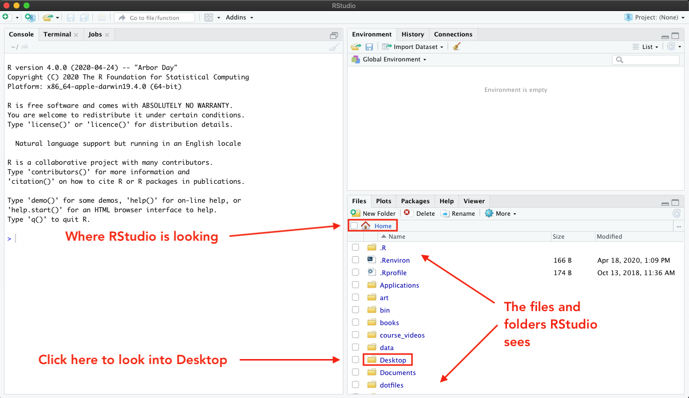
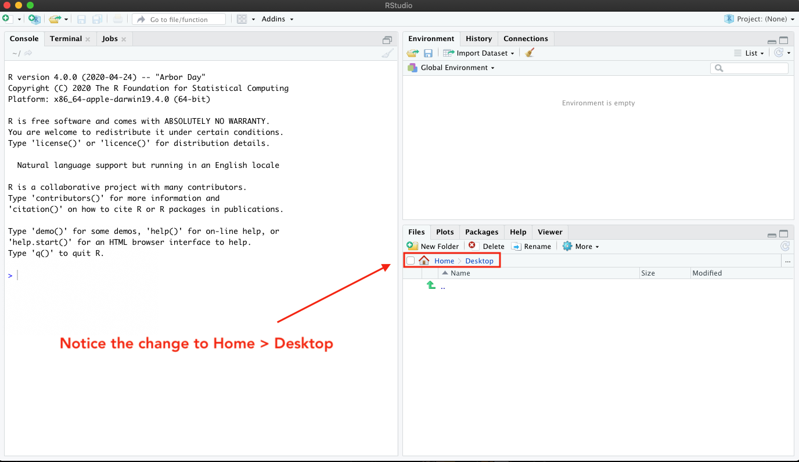
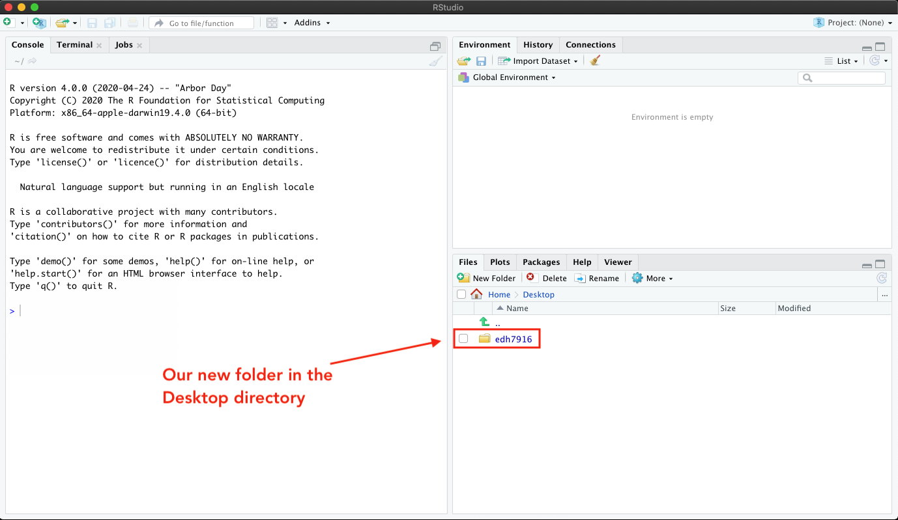
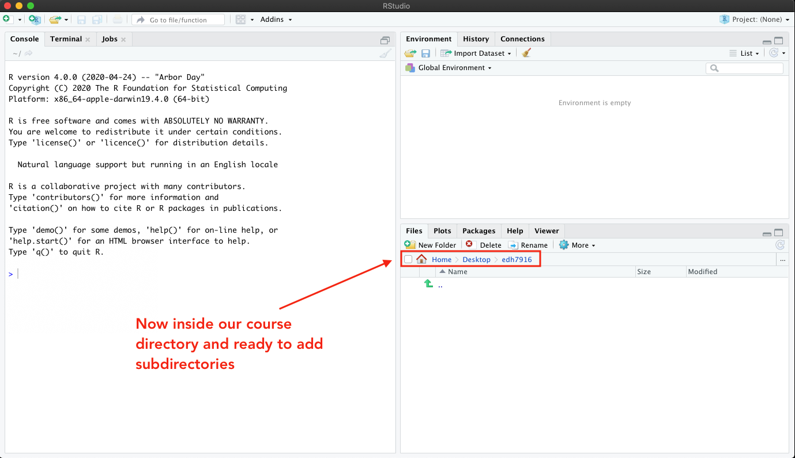
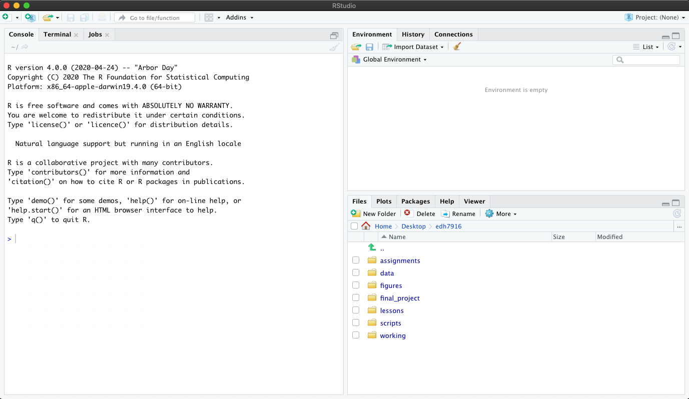
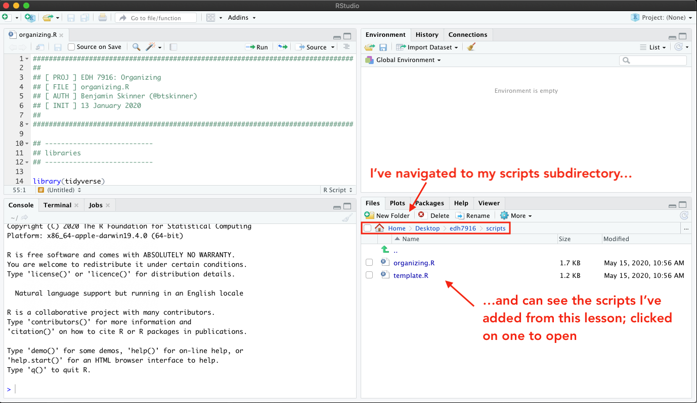
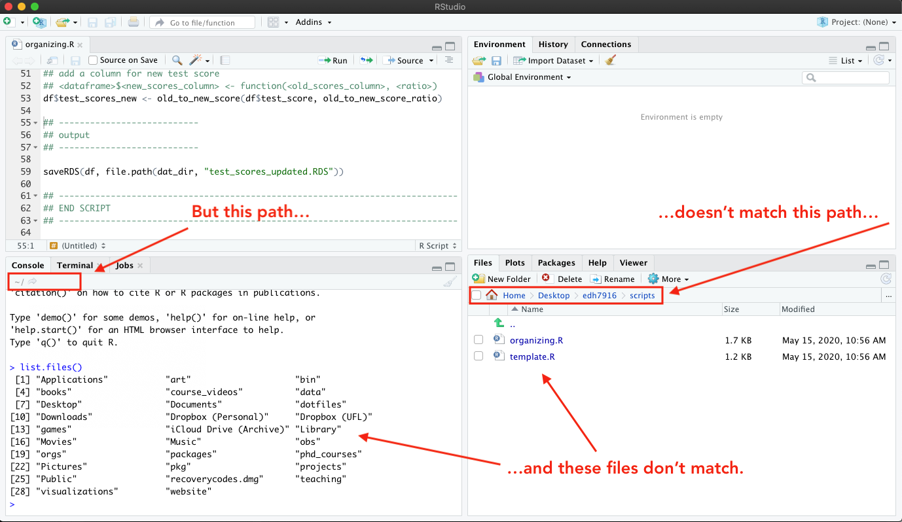
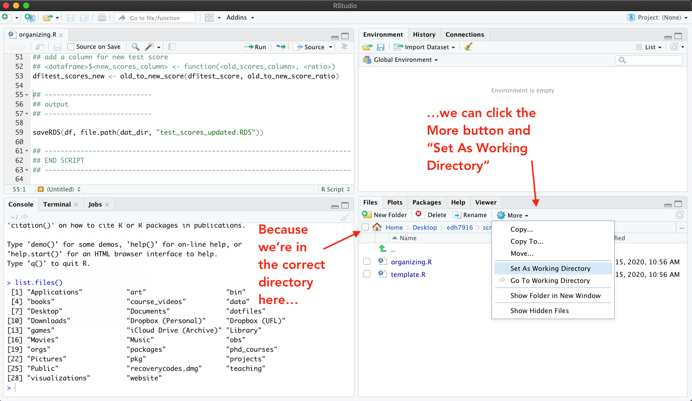
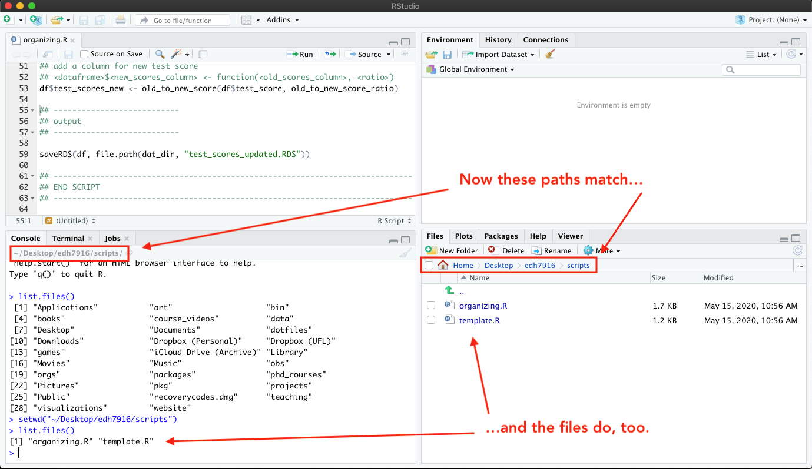

In this lesson, we'll discuss how to organize both a project directory
and an R script. While there's no one exact way to do either, there
are good practices that you should generally follow.

# Organizing a project directory

We'll begin with how to organize your course and project files.

## A place for everything and everything in its place

Every data analysis project should have its own set of organized
folders. Just like you might organize a kitchen so that ingredients,
cookbooks, and prepared food all have a specific cabinet or shelf, so
too should you organize your project. We'll organize our course
directory in a similar fashion.

But computers are pretty good at finding files, you say: you can use
your machine's search feature to look for what you need. If you don't
have that many files to look through, you might not be too bad at
quickly scanning to find what you want either. If this is the case,
then why bother organizing a project directory?  Why not just dump
everything --- scripts, data, figures, tables, notes, _etc_ --- into a
single folder (_My downloads folder works just fine, thank you..._)? If
you need something, the computer can definitely find it.

So what's the big deal?

The big deal is that you are thinking from your computer's perspective
when you should be thinking from the perspective of you, your
collaborators (which includes your future self), and future
replicators (which also includes yourself). Search features are nice,
but there's no substitute for being able to look through a project's
files _just by looking through the project folders_. When a project is
well organized, it's much easier to understand how everything --- each
input, process, and output --- fits together.

## A common directory structure

As a reminder, here's basic directory structure for this class:

```
student_skinner/
|
|__ assignments/
|__ data/
|__ figures/
|__ final_project/
|__ lessons/
|__ scripts/
|__ working/
```

As you can see, we have a main directory (or folder --- same thing)
for the course called `student_skinner`. Your directory has a similar
name, but with your last name: `student_<last name>`. That said, it
could be named anything useful. This can live on your computer
wherever you want to put it: on your Desktop, in your home directory,
in another folder where you store materials for your other classes ---
wherever makes sense for you.

Inside the main course directory, there are subdirectories (or
subfolders --- again, same thing) for the different types of files
you'll collect or create this term. These subdirectories have
self-explanatory names: PDFs for assignments go into `assignments`,
PDFs for lessons into `lessons` and so on.

Note that this type of structure works well with research projects. Of
course, you're unlike to have `assignments` or `lessons` subfolders
within a research project directory, but you almost certainly will
have subfolders for your `scripts`, `data`, and `figures` as well as a
`working` folder (which some people call `scratch`, like a scratch
pad) where you can store odds and ends or practice new ideas.

You may ask: why these folders in particular or, why should I have
separate `data`, `scripts`, and `figures` in my project directory?

Think about it this way. Following our kitchen analogy from before, we
have:

- **Ingredients (Inputs)** - `data`
- **Cookbooks (Processes)** - `scripts`
- **Prepared food (Outputs)** - `figures`

Particular projects may require particular folders (for example, you
may find it useful to have a special subfolder for `tables` or one for
regression output called `estimates`). But in almost all cases, your
project directory should have separate subfolders for your data, your
analysis scripts, and any output you produce.

### Great! How to I set this up?

You can create new directories using your operating system. For both
MacOS and Windows, one of the easiest ways to make a new folder is to
right-click on your Desktop and choose to create a new folder. You can
then open this folder and continue right-click creating subfolders
until you have what you need.

You can also use the RStudio **Files** tab (lower right facet) to
create new folders. Even though we already have our course directory
from GitHub, let's practice creating a directory structure from
scratch, so you can make your own in the future.

Let's say I want to create a directory on my Desktop. 



When I open RStudio, notice that it starts in my Home folder (we'll
talk more about what that means to "start in" below). You can see this
by looking at the menu bar in the **Files** facet. It also helps that I
can see all the folders and files listed in the window. Because I know
generally what's in my home directory (`Applications`, `Desktop`,
`Documents`), it's clear to me that that's where I am. Depending on
your settings, RStudio may start somewhere else for you --- that's
fine, just check the menu bar.

So I'm in my home folder, but I want to be in my Desktop folder. Easy
enough: I can just click the Desktop link in the window.



Notice how the file list has changed. There's nothing there! That's
because I have a very clean Desktop! But if you have files on your
Desktop, you should see those now. Either way, I can see that the menu
bar address has changed to add a folder: _Home > Desktop_.

To create a new folder, I can click on the **New Folder** button and
then give my new folder a name in the drop down menu. Let's call it
`edh7916` to keep it separate from our `student_*` course directory.


Now you can see my new folder, which I've called
`edh7916`.



Clicking on that, I see the menu address change to _Home > Desktop >
edh7916_ and nothing inside, which is expected since it's a newly
created folder. 



Time to add the subdirectories!

> #### Quick exercise
> Fill out this directory with the following subdirectories: 
> - data
> - figures
> - scripts
> - tables
> - working
>
<!-- > When you're finished, it should look something like this in the -->
<!-- > **Files** facet: -->
<!-- > -->
<!-- >  -->
<!-- > -->
<!-- > **NB**: Your menu path and course directory name may look different -->
<!-- > from mine, but the subdirectories in your practice directory should -->
<!-- > look the same. -->
<!-- > -->
<!-- > **NB** When you download course files, they most likely end up in -->
<!-- > your computer's downloads folder by default. If that's the case just -->
<!-- > use the file system on your computer to drag and drop these files -->
<!-- > where they belong. -->

## Quick aside into how applications find files

Above, I said

> When I open RStudio, notice that it **starts in my Home folder**...

What does that mean, _starts in_?

There are two common ways to open a file on your computer with the
correct application:

1. Open the application you know you need --- let's say Excel --- and
then choose to "_Open..._" an existing file from the main menu. When
you go this route, a little window will open or you'll see a drop down
menu and will have to navigate to find your file.
1. Find the file you want open and then double-click it. On most
computers, the correct application will automagically open and your
file will be loaded (_e.g._ double click on an `*.xlsx` file and Excel
will open with your file ready to go).

In this way, RStudio is an application just like any other application
on your computer. If you double-click on `*.R` scripts or `*.md` or
`*.Rmd` files, it's likely that RStudio will open. However, if you
open RStudio first, it begins by assuming you want to look for/store
files in a default location --- most likely your _Home_ directory
unless you've changed the settings. 

This what I mean by _starts in_.

As you might be guessing by this point, how people set up their
computers or organize their files will affect where RStudio needs to
look for the correct files. One skill you'll have to develop is being
able to navigate to the proper **working directory**, that is, telling
RStudio where your files are located.

## Setting your working directory

After downloading today's scripts (the <i class="fas fa-code"></i>
icons at the top of the page) and adding them to the `scripts`
subdirectory of my course directory, I've opened one in
RStudio (**NB:** You should already have these in your course repo
from GitHub). Notice that we're back to our `student_*` directory and
not in the `edh7916` test directory we made above.



Despite what I see in the **Files** facet, however, my **working
directory** is still set to my home directory. This means that when
RStudio starts looking for files, it's going to start in the home
folder.

How do I know that? Notice that the path shown on the **Console**
facet doesn't match the one on the **Files** facet. Also, when I run
the R function `list.files()` --- which by default lists all the files
in the current directory --- in the console, I see the files in my
home (`~`) directory rather than those I see in
`~/Desktop/student_skinner/scripts` directory.



There are a number of ways to fix this, but the easiest way is to
click the _More_ button (with the gear) in the **Files** facet. In the
drop down menu, you'll see an option to "Set As Working Directory."
Because you are in the `scripts` directory, you can click it to
correctly tell RStudio that you are working in `scripts`, not elsewhere.



Clicking "Set As Working Directory" sends the command `setwd()` to the
**Console** with the correct path to get from where RStudio starts to
where you want to be. Now you can see that the paths in each facet's
menu bar match and when we run `list.files()` again, we now see the
two R scripts listed on the left that we see listed on the right.



Now that you've found your course script files in RStudio, the next
step is to understand how to make sure they can find your data and
output folders.

## Absolute vs relative paths

Every quantitative data analysis will need to coordinate the three
ingredients discussed above (data, scripts, output). When your script
attempts to read in data, it has be able to find it on your
computer. Similarly, when it's time to make a figure, its needs to
know where to save it. In other words, you need to give it **paths**
to your other folders. 

There are two basic types of paths --- **relative** and **absolute**
--- and which type you choose to use will affect the
transferability and replicability of your work.

A quick analogy. Imagine you ask a friend for directions: _how do I
get to the state park?_ Your friend has three ways they can give you
directions:

1. Directions to the park from _their_ house
1. Directions to the park from _your_ house
1. Directions to the park from a common landmark

The first way is really easy for your friend, but it puts extra work
on you. Either you have to go to their house first so that the
directions make sense, or you have to translate them from your
perspective. Directions like these are annoying at best and useless if
you don't know how to get to their house.

The second way is really nice to you, but difficult for your
friend. However, the directions aren't as useful if you don't plan to
start from your house. In addition, these directions also aren't
reusable for other people --- if a third friend tries to get the
directions from you, you'll just replicate the first problem for them.

The third way is the best compromise. If you each know how to get to a
common landmark, then you can head to the landmark however works best
for you and, once there, follow your friend's directions to the
park. As a bonus, these directions are shareable: anyone who can get
to the common landmark can use the directions to get to the park.

In the world of our class directory, the first two sets of directions
are **absolute** paths while the third is a **relative** path. Since
we all share the same course directory structure, as long as each of
us can get to primary directory (_e.g._ `student_skinner`), then all the
subdirectories will be in the same relative locations on each of our
computers. In practice, this means I can give you all the same script
and it should work.

The same holds true for a research project directory. If your project
is organized into folders and you share the full project directory
with another researcher, then as long as they can get to the correct
starting point --- _e.g._ your `scripts` folder --- they can run your
project easily.

### Examples

Let's say I want to give you the path to the course `scripts`
directory. Here are two:

- **Absolute path**: `~/Desktop/student_skinner/scripts`
- **Relative path**: `./scripts`

The first absolute path only works for you if you both named your
course folder `student_skinner` and put it on your desktop. For some of you,
it might work, but that would be due to happenstance rather than good
planning on my part.

The second relative path assumes we are in the primary class directory
(`student_skinner`). Notice the `.` (dot)? On most systems, dots in a file
path work like this:

- `.` (one dot): _this_ directory/folder
- `..` (two dots): _up one_ directory (_e.g._ from `student_skinner/scripts`
  to `student_skinner`

What if we are in the `scripts` folder, but want to access a file in
the `data` directory? We use two dots (`..`):

- from `scripts` to `data`: `../data`

What this says is

1. `..`: back up into the main folder, `student_skinner`
2. `/data`: from the main folder (`student_skinner`), go into `data`

> #### Quick exercise 
> Use R's `list.files(".")` command in the console to show all the files
> in the current directory. Next, use `list.files("..")` to show all
> the files in the directory above the current. Finally, use
> `list.files("<...>")` with a relative link to see all the files
> inside the `data` folder (replace `<...>` with the correct relative
> path). 

# Organizing a script

## Do one thing and do it well

A general philosophy for every project: your scripts should do one
thing and do it well. Rather than have a single giant script with
5,000 lines that runs your entire analysis, it's generally clearer to
have many smaller scripts that are run in conjunction with one another
(_e.g._ one script that reads in the data and cleans it, one that
performs the analysis, one that makes the figures, _etc_).

But even if you only need a single small script, this organizing
principle still applies. Always organize your scripts into clear
sections in which you perform specific analytic tasks.

## Template

Here's a template for an R script with clearly defined sections that
you can use:


```r
################################################################################
##
## [ PROJ ] < Name of the overall project >
## [ FILE ] < Name of this particular file >
## [ AUTH ] < Your name + email / Twitter / GitHub handle >
## [ INIT ] < Date you started the file >
##
################################################################################

## ---------------------------
## libraries
## ---------------------------

## ---------------------------
## directory paths
## ---------------------------

## ---------------------------
## settings/macros
## ---------------------------

## ---------------------------
## functions
## ---------------------------

## -----------------------------------------------------------------------------
## < BODY >
## -----------------------------------------------------------------------------

## ---------------------------
## input
## ---------------------------

## ---------------------------
## process
## ---------------------------

## ---------------------------
## output
## ---------------------------

## -----------------------------------------------------------------------------
## END SCRIPT
## -----------------------------------------------------------------------------
```

And here's the template with a very simple project outline:


```r
################################################################################
##
## [ PROJ ] EDH 7916: Organizing
## [ FILE ] organizing.R
## [ AUTH ] Benjamin Skinner (@btskinner)
## [ INIT ] 13 January 2020
##
################################################################################

## ---------------------------
## libraries
## ---------------------------

library(tidyverse)

## ---------------------------
## directory paths
## ---------------------------

dat_dir <- file.path("..", "data")
fig_dir <- file.path("..", "figures")

## ---------------------------
## settings/macros
## ---------------------------

old_to_new_score_ratio <- 1.1

## ---------------------------
## functions
## ---------------------------

old_to_new_score <- function(test_score, ratio) {
    return(test_score * ratio)
}

## -----------------------------------------------------------------------------
## BODY
## -----------------------------------------------------------------------------

## ---------------------------
## input
## ---------------------------

df <- readRDS(file.path(dat_dir, "test_scores.RDS"))

## ---------------------------
## process
## ---------------------------

## add a column for new test score
## <dataframe>$<new_scores_column> <- function(<old_scores_column>, <ratio>)
df$test_scores_new <- old_to_new_score(df$test_score, old_to_new_score_ratio)

## ---------------------------
## output
## ---------------------------

saveRDS(df, file.path(dat_dir, "test_scores_updated.RDS"))

## -----------------------------------------------------------------------------
## END SCRIPT
## -----------------------------------------------------------------------------
```

### Header

At the very top of your script, give all the relevant information
about the script. 

```r
################################################################################
##
## [ PROJ ] EDH 7916: Organizing
## [ FILE ] organizing.R
## [ AUTH ] Benjamin Skinner (@btskinner)
## [ INIT ] 13 January 2020
##
################################################################################
```

Specifically:

- `[ PROJ ]`: tell what project it belongs to
- `[ FILE ]`: give the file's name
- `[ AUTH ]`: give your name and a way to contact you
- `[ INIT ]`: give the date you started the file

If you aren't using a version control system like git, then it would
make sense to also include a line for the last time you revised the
file: `[ REVN ]`.

**NOTE** You don't have to make your header look _exactly_ like
mine. This is just what I've landed on after a few years. As long as
you have the relevant information, personalize the details as you
will.

#### Libraries: what extra code do we need to make this code work?

After the informational header, the first thing you want to include
are the libraries you need to call for your script to work. In this
course, you will almost always call the **tidyverse** library.

```r
## ---------------------------
## libraries
## ---------------------------

library(tidyverse)
```

#### Paths: where is everything and where is it going?

Rather than hard-coding / rewriting all the paths in the script below,
we can save the paths in an object. We use the `file.path()` command
because it is smart. Some computer operating systems use forward
slashes, `/`, for their file paths; others use backslashes,
`\`. Rather than try to guess or assume what operating system future
users will use, we can use R's function --- `file.path()` --- to check
the current operating system and build the paths correctly for
us. Simply separate each folder and path with a comma so that
`file.path("..", "data")` becomes `"../data"`, which is stored in
`dat_dir`. 

```r
## ---------------------------
## directory paths
## ---------------------------

dat_dir <- file.path("..", "data")
```

Notice our relative link? This script assumes that the data file we
need for the analysis, `test_scores.RDS`, is stored in another
subfolder called `data` that is _outside this subfolder, but in the
same primary folder_. Visually:

```
student_skinner/
|
|__data/
|    \--+ test_scores.RDS
|
|__scripts/
     \--+ organizing.R
```

This means two things:
1. Your working directory needs to be set to `student_skinner/scripts`
2. The data file needs to be in `student_skinner/data`

<!-- > #### Quick exercise  -->
<!-- > Run these lines of code and then print `dat_dir` and `fig_dir` to -->
<!-- > the console. What do you see? -->

#### Settings/Macros: what numbers, options, or settings should be consistent?

Programmers hate "magic" numbers. What are "magic" numbers (or "magic"
strings or "magic" settings)? They are values that are hard-coded in
your analysis script.

Say you want to convert old test scores to a new test score based some
ratio, say 1.1 (10% increase). You could multiply every old test
score value throughout your script by 1.1, but what if you later
decide it should be 1.2? You need to change every instance of
1.1 --- don't miss any!

In addition, does 1.1 have any inherent meaning? To me, not really. If
later on you take a look at your script and see that you are
multiplying by 1.1 (_e.g._ `x * 1.1`), you'll have to go back to your
notes or memory --- or just guess (!) --- what that 1.1 represents.

```r
## ---------------------------
## settings/macros
## ---------------------------

old_to_new_score_ratio <- 1.1
```

It's better to store these constant reusable values at the top of your
script in an object (or macro, as I call it here) that has a clear
name. `old_to_new_score_ratio <- 1.1` is clear in its meaning, so when
we use it below, we'll know what it means. Also, if we decide we need
to fix / change the value later, we only have to change it once.

Put all such numbers, strings, and settings here.

#### Functions: what useful code will be repeated below?

Other than the functions that come with the libraries we load, we
might write functions ourselves. At this point in the course, I'm not
concerned that you know how to write a function or how one works. Just
notice how the function has a good name that tells what it does:
converts old scores to new scores using a ratio (we'll use the one we
defined above).

```r
## ---------------------------
## functions
## ---------------------------

old_to_new_score <- function(old_test_score, ratio) {
    return(old_test_score * ratio)
}
```

### Body

The body of your script is where the main work happens. You may need
more sections, but at the very least you should generally have
dedicated spots for reading in your data, working with your data, and
saving any output.

#### Input: read in (or create) data we'll work with

Here we read in a very small tibble (a tidyverse version of a data
frame) with some student IDs and their test scores. We can see this if
we look at the data.

```r
## ---------------------------
## input
## ---------------------------

df <- readRDS(file.path(dat_dir, "test_scores.RDS"))
```

> #### Quick exercise(s)
> 1. What is the output of `file.path(dat_dir, "test_scores.RDS"))`?
>    Highlight and run the bit of code by itself to check.
> 1. Look at the data, both using RStudio's **View** and by just printing
>    the object to the console.

#### Process: do the analytic work

Let's say that all we want to do is add a new column to our tibble
that holds the updated test scores as computed by our function and
ratio. 

We will cover all of this in later classes, but so you have an idea of
what's happening, here's the process:

1. We have our tibble `df` that are going to modify, which will change
   because we assign the results back to itself: `df <- df <
   ...changes... >`
1. We use the pipe `%>%` to move from our tibble to the `mutate()`
   command from the **dplyr** library (part of the **tidyverse** ---
   we'll be using it a lot in this course) to create and add this
   column.
1. The new data column will be called `test_score_new`
1. Each row of `test_score_new` will be a transformation of the
   original test score column, `test_score`. We use the function
   above, `old_to_new_score()`, and the macro we stored,
   `old_to_new_score_ratio`, to make the change.

```r
## ---------------------------
## process
## ---------------------------

## add a column for new test score using our function
df <- df %>%
    mutate(test_score_new = old_to_new_score(old_test_score = test_score,
                                             ratio = old_to_new_score_ratio))
```

#### Output: write the results from our analyses

Finally, we save our tibble. Notice how we use a new name. We'll talk
more about data consistency in a later lesson, but suffice to say for
now that we never want to overwrite our original data. Save a new file
with a useful name to keep everything separate.

```r
## ---------------------------
## output
## ---------------------------

saveRDS(df, file.path(dat_dir, "test_scores_updated.RDS"))
```

### Footer (close script)

With that, we're finished! While not necessary, it's nice to have a
clear indication of where your script ends. This is particularly handy
down the road when you have many scripts called one after another. If
you have a problem and have to go through lines of output, knowing
where a script ends can be very helpful.

```r
## -----------------------------------------------------------------------------
## END SCRIPT
## -----------------------------------------------------------------------------
```

And with that, we're finished!

## POSTSCRIPT: Three considerations about naming files and macros

When naming folders, files, objects, or macros, keep these naming
rules in mind:

1. Name it well (be clear): _e.g._ `data_clean.R` or `old_to_new_score_ratio`
1. Name it consistent with other items (have a style): _e.g._
   `data_1.RDS`, `data_2.RDS`,`data_3.RDS`, _etc_
1. Name it without spaces!
   - **NO**: `data clean.R`
   - **YES**: `data_clean.R`

Per this last point, more person hours are lost than can be counted
dealing (or failing to deal) with file names that have spaces. Don't
do it! Use underscores or hyphens to separate words.

