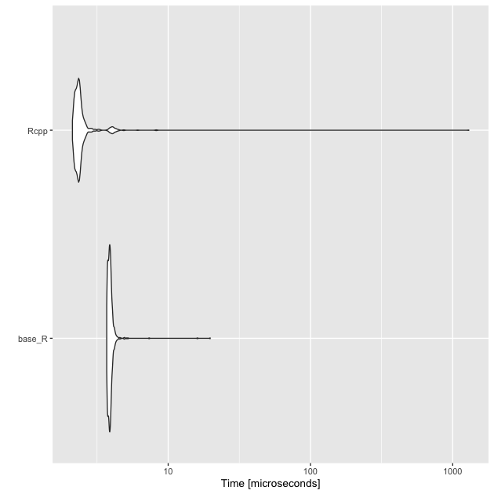
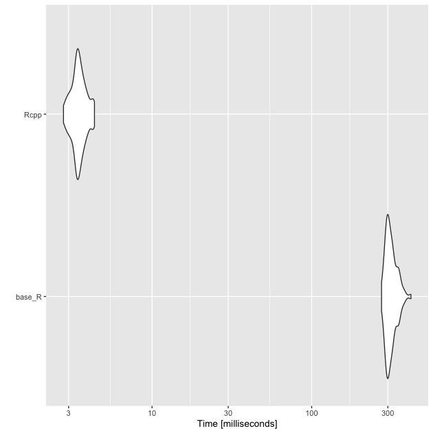
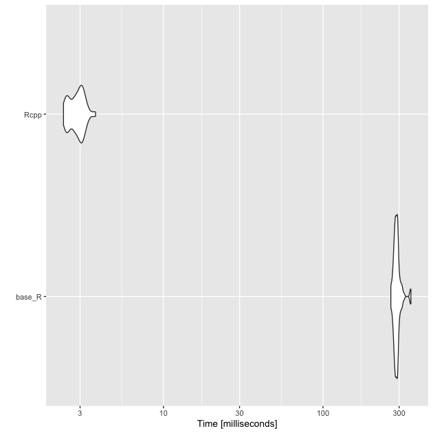

R is really powerful, but for some tasks can be very slow. As data get
larger and scripts require more complex algorithms and demanding
tasks, even small bits of sluggishness become huge in the
aggregate. Compiled languages such as C and C++ can be much faster
than R, but require greater programming skill. While learning a
compiled language is useful for many researchers, the upfront time
needed to learn is often too steep for any given project.

Fortunately, the [Rcpp](https://CRAN.R-project.org/package=Rcpp)
package bridges the gap between the two worlds. While there is a bit
of a learning curve for Rcpp, which is based on C++, much R code can
be, with few modifications, adjusted to become Rcpp code and run much
faster for complex tasks.

This module will give one example of such a speed up. In my own
research, I've computed the [Great Circle ("as the crow flies") 
distance](https://en.wikipedia.org/wiki/Great-circle_distance) between
colleges and various geographic centroids many times using either the
[Haversine](https://en.wikipedia.org/wiki/Haversine_formula) or
[Vincenty](https://en.wikipedia.org/wiki/Vincenty%27s_formulae)
formula. But with over 7,500 colleges and universities in the United
States, measuring the distance from each county centroid (around
3,000) became slow enough. Doing the same for all census tracks
(around 70,000) and census block groups (over 200,000) was almost
impossible. With small modifications to base R formula functions,
however, I was able to convert them to compiled Rcpp function which
run much, much faster.


```r
## ---------------------------
## libraries
## ---------------------------
library(tidyverse)
```

```
## ── Attaching packages ─────────────────────────────────────── tidyverse 1.3.1 ──
```

```
## ✔ ggplot2 3.3.5     ✔ purrr   0.3.4
## ✔ tibble  3.1.6     ✔ dplyr   1.0.8
## ✔ tidyr   1.2.0     ✔ stringr 1.4.0
## ✔ readr   2.1.2     ✔ forcats 0.5.1
```

```
## ── Conflicts ────────────────────────────────────────── tidyverse_conflicts() ──
## ✖ dplyr::filter() masks stats::filter()
## ✖ dplyr::lag()    masks stats::lag()
```

```r
library(Rcpp)
library(microbenchmark)
```

And as always, we are working in the `./scripts` subdirectory.


```r
## ---------------------------
## directory paths
## ---------------------------

## assume we're running this script from the ./scripts subdirectory
dat_dir <- file.path("..", "data")
rcpp_dir <- file.path(dat_dir, "rcpp")
```

# Read in data

This module uses two data frames. The first has the names and locations of
all colleges with a physical campus in 2015. The second has the
locations of every census block group in the United States from the
2010 Census.


```r
## ---------------------------
## input data
## ---------------------------

## assume we're running this script from the ./scripts subdirectory
df_col <- readRDS(file.path(rcpp_dir, "collegeloc.RDS"))
df_cbg <- readRDS(file.path(rcpp_dir, "cblocks.RDS"))
```

## College locations

Here's a quick peek at the college location data (around 7,600
institutions).


```r
## college locations
df_col
```

```
## # A tibble: 7,647 × 5
##    unitid instnm                              fips5   lon   lat
##     <int> <chr>                               <chr> <dbl> <dbl>
##  1 100654 Alabama A & M University            01089 -86.6  34.8
##  2 100663 University of Alabama at Birmingham 01073 -86.8  33.5
##  3 100690 Amridge University                  01101 -86.2  32.4
##  4 100706 University of Alabama in Huntsville 01089 -86.6  34.7
##  5 100724 Alabama State University            01101 -86.3  32.4
##  6 100733 University of Alabama System Office 01125 -87.5  33.2
##  7 100751 The University of Alabama           01125 -87.5  33.2
##  8 100760 Central Alabama Community College   01123 -85.9  32.9
##  9 100812 Athens State University             01083 -87.0  34.8
## 10 100830 Auburn University at Montgomery     01101 -86.2  32.4
## # … with 7,637 more rows
```

## Census block group locations

And here's the census block group location data (around 217,000 block groups).


```r
## census block group locations
df_cbg
```

```
## # A tibble: 217,740 × 4
##    fips11         pop   lon   lat
##    <chr>        <int> <dbl> <dbl>
##  1 010010201001   698 -86.5  32.5
##  2 010010201002  1214 -86.5  32.5
##  3 010010202001  1003 -86.5  32.5
##  4 010010202002  1167 -86.5  32.5
##  5 010010203001  2549 -86.5  32.5
##  6 010010203002   824 -86.5  32.5
##  7 010010204001   944 -86.4  32.5
##  8 010010204002  1937 -86.4  32.5
##  9 010010204003   935 -86.4  32.5
## 10 010010204004   570 -86.4  32.5
## # … with 217,730 more rows
```

# Compute great circle distance with Haversine


The [Haversine
formula](https://en.wikipedia.org/wiki/Haversine_formula#The_haversine_formula)
is a fairly straightforward trigonometric problem. Since the
coordinates in the data are in latitude and longitude and the formula
requires radians, a quick helper function `deg_to_rad()` is used to
make the conversion.


```r
## convert degrees to radians
deg_to_rad <- function(degree) {
  m_pi <- 3.141592653589793238462643383280
  return(degree * m_pi / 180)
}

## compute Haversine distance between two points
dist_haversine <- function(xlon, xlat, ylon, ylat) {

  ## radius of Earth in meters
  e_r <- 6378137
  
  ## return 0 if same point
  if (xlon == ylon & xlat == xlon) { return(0) }
  
  ## convert degrees to radians
  xlon = deg_to_rad(xlon)
  xlat = deg_to_rad(xlat)
  ylon = deg_to_rad(ylon)
  ylat = deg_to_rad(ylat)
  
  ## haversine distance formula
  d1 <- sin((ylat - xlat) / 2)
  d2 <- sin((ylon - xlon) / 2)
  
  return(2 * e_r * asin(sqrt(d1^2 + cos(xlat) * cos(ylat) * d2^2)))
}
```


With the formula, we can compute the distance in meters between the
first census block group and the first college in the data set pretty
quickly. 


```r
## store first census block group point (x) and first college point (y)
xlon <- df_cbg[[1, "lon"]]
xlat <- df_cbg[[1, "lat"]]
ylon <- df_col[[1, "lon"]]
ylat <- df_col[[1, "lat"]]

## test single distance function
d <- dist_haversine(xlon, xlat, ylon, ylat)

## show
d
```

```
## [1] 258212.3
```

> #### Quick exercise
> Find the coordinates of two places you know the distance between
> pretty well (say, your hometown and where you live now or your first
> college or the nearest big city). Compute the distance and compare
> to Google\'s driving distance. It should be shorter (crows fly very
> straight), but similar. You may want to convert the meters to
> kilometers or miles. As always Google is your friend for all these
> steps. 

## Many to many distance matrix


Now that we have a core function, let's write a larger function that
can take many input points, many output points, and compute the
distances between them.


```r
## compute many to many distances and return matrix
dist_mtom <- function(xlon,         # vector of starting longitudes
                      xlat,         # vector of starting latitudes
                      ylon,         # vector of ending longitudes
                      ylat,         # vector of ending latitudes
                      x_names,      # vector of starting point names
                      y_names) {    # vector of ending point names

  ## init output matrix (n X k)
  n <- length(xlon)
  k <- length(ylon)
  mat <- matrix(NA, n, k)
  
  ## double loop through each set of points to get all combinations
  for(i in 1:n) {
    for(j in 1:k) {
      ## compute distance using core function
      mat[i,j] <- dist_haversine(xlon[i], xlat[i], ylon[j], ylat[j])
    }
  }
  
  ## add row and column names
  rownames(mat) <- x_names
  colnames(mat) <- y_names
  return(mat)
}
```

Let's test it with a subset of ten starting points.


```r
## test matrix (limit to only 10 starting points)
distmat <- dist_mtom(df_cbg$lon[1:10], df_cbg$lat[1:10],
                     df_col$lon, df_col$lat,
                     df_cbg$fips11[1:10], df_col$unitid)

## show
distmat[1:5,1:5]
```

```
##                100654   100663   100690   100706   100724
## 010010201001 258212.3 119349.8 31495.73 251754.3 21138.09
## 010010201002 256255.2 117447.3 32284.61 249798.4 22263.60
## 010010202001 256775.4 118210.3 31047.25 250348.1 21059.86
## 010010202002 258084.9 119554.9 30210.67 251665.2 20017.60
## 010010203001 256958.5 118703.3 29758.10 250567.0 19905.92
```

> #### Quick exercise
> Can you find the minimum distance for each starting point? What's
> the name of the nearest end point?

## Nearest end point


Rather than return a full matrix of distances that we then need to
evaluate to find the shortest distance, let's write a new function,
`dist_min()`, that will take two vectors of points again, but only
return the closest point in the second group, with distance, for each
point in the first group.


```r
## compute and return minimum distance along with name
dist_min <- function(xlon,         # vector of starting longitudes
                     xlat,         # vector of starting latitudes
                     ylon,         # vector of ending longitudes
                     ylat,         # vector of ending latitudes
                     x_names,      # vector of starting point names
                     y_names) {    # vector of ending point names
    
    ## NB: lengths: x coords == x names && y coords == y_names
    n <- length(xlon)
    k <- length(ylon)
    minvec_name <- vector('character', n)
    minvec_meter <- vector('numeric', n)

    ## init temporary vector for distances between one x and all ys
    tmp <- vector('numeric', k)

    ## give tmp names of y vector
    names(tmp) <- y_names

    ## loop through each set of starting points
    for(i in 1:n) {
        for(j in 1:k) {
            tmp[j] <- dist_haversine(xlon[i], xlat[i], ylon[j], ylat[j])
        }

        ## add to output matrix
        minvec_name[i] <- names(which.min(tmp))
        minvec_meter[i] <- min(tmp)
    }

    return(data.frame('fips11' = x_names,
                      'unitid' = minvec_name,
                      'meters' = minvec_meter,
                      stringsAsFactors = FALSE))
}
```

Let's test it out.


```r
## test matrix (limit to only 10 starting points)
mindf <- dist_min(df_cbg$lon[1:10], df_cbg$lat[1:10],
                  df_col$lon, df_col$lat,
                  df_cbg$fips11[1:10], df_col$unitid)
## show
mindf
```

```
##          fips11 unitid   meters
## 1  010010201001 101471 15785.88
## 2  010010201002 101471 14228.69
## 3  010010202001 101471 13949.21
## 4  010010202002 101471 14870.35
## 5  010010203001 101471 13362.81
## 6  010010203002 101471 14389.79
## 7  010010204001 101471 12704.73
## 8  010010204002 101471 13270.80
## 9  010010204003 101471 14102.44
## 10 010010204004 101471 14756.51
```

> #### Quick exercise
> How long will it take to find the closest college to each census
> block group? Use `system.time()` and extrapolate to make a best guess.


# Rcpp


These worked well, but we only did 10 starting points. We need to find
it for over 200,000 starting points. What we need is to convert the
base R functions into Rcpp functions.

Below, the full script, `dist_func.cpp`, is discussed in pieces.

## Front matter

The head of an Rcpp script is like an R script in that this is place
to `#include` other header files. This is akin to having
`library(...)` in an R script. At the very least, an Rcpp script needs
to include it's own header files, `Rcpp.h`.

Next, we define preprocessor replacements. In the process of compiling
the script, that is, turning the Rcpp code that's human readable into
machine-readable byte code, the preprocessor first runs through the
script. One job is to replace any `#define` directive with the value
it has been given. In our code, that means that anywhere in the script
that `e_r` is found, `6378137.0` literally replaces it.

Finally, we load the `Rcpp` namespace with `using namespace
Rcpp;`. This means that we don't have to keep repeating `Rcpp::<...>`
before every function we want. Sometimes, it's better to do it the
long way, especially if you are using functions from multiple
libraries that may overlap, but we're okay doing it this way this
time. 

```c++
// header files to include
#include <Rcpp.h>

// preprocessor replacements
#define e_r 6378137.0		
#define m_pi 3.141592653589793238462643383280

// use Rcpp namespace to avoid Rcpp::<...> repetition
using namespace Rcpp;
``` 

## Utility functions

First, we have the two utility functions to convert degrees to radians
and to compute the Haversine distance between two points. A few things
to note right away:  

* Rcpp comments use `//` or `/* ... */`  
* Lines must end in a semi-colon, `;`  
* Variables are [strongly
  typed](https://en.wikipedia.org/wiki/Strong_and_weak_typing)  
  
When a language is strongly typed, the user must tell the compiler
the variable type, like `double`, `int`, etc. R will guess what you
want and change on fly. This is a nice interactive feature, but is
part of what makes R slow sometimes. By strongly typing a variable,
the computer knows right away what you want and doesn't waste time or
memory making adjustments.

A few other things to notice:  

* `doubles` should end in a `.` or `.0`, otherwise they are assumed to
  be integers; dividing by integers can have weird outcomes so unless
  you are REALLY sure you want an integer, a floating point number
  like a `double` is probably what you want (see `degree * m_pi /
  180.0`)  
* The variable type before the function name tells the compiler what
  form the function output will take  
* Function arguments must also be typed  

Finally, for the function to be available to you as a user, you must
put `// [[Rcpp::export]]` just before it.

```c++
// convert degrees to radians
// [[Rcpp::export]]
double deg_to_rad_rcpp(double degree) {
  return(degree * m_pi / 180.0);
}

// compute Haversine distance between two points
// [[Rcpp::export]]
double dist_haversine_rcpp(double xlon,
			   double xlat,
			   double ylon,
			   double ylat) {

  // return 0 if same point
  if (xlon == ylon && xlat == xlon) return 0.0;

  // convert degrees to radians
  xlon = deg_to_rad_rcpp(xlon);
  xlat = deg_to_rad_rcpp(xlat);
  ylon = deg_to_rad_rcpp(ylon);
  ylat = deg_to_rad_rcpp(ylat);

  // haversine distance formula
  double d1 = sin((ylat - xlat) / 2.0);
  double d2 = sin((ylon - xlon) / 2.0);
  return 2.0 * e_r * asin(sqrt(d1*d1 + cos(xlat) * cos(ylat) * d2*d2));	 
}
```

## Many to many distance matrix

Moving to the main functions, notice that base R function has been
changed only slightly. For the most part, the difference is that
variables, argument, and function return must be typed.

A few other differences to note:  

* the length of a vector is measured with `.size()`  
* loops in C++ take the form (<init>; <test>; <increment>), which
  works as "start `i` as 0, check if `i` is less than the number of
  starting points, `n`, add 1 to `i`, then run the loop; if the check
  fails, skip the loop.

```c++
// compute many to many distances and return matrix
// [[Rcpp::export]]
NumericMatrix dist_mtom_rcpp(NumericVector xlon,
			     NumericVector xlat,
			     NumericVector ylon,
			     NumericVector ylat,
			     CharacterVector x_names,
			     CharacterVector y_names) {

  // init output matrix (x X y)
  int n = xlon.size();
  int k = ylon.size();
  NumericMatrix distmat(n,k);

  // double loop through each set of points to get all combinations
  for(int i = 0; i < n; i++) {
    for(int j = 0; j < k; j++) {
      distmat(i,j) = dist_haversine_rcpp(xlon[i],xlat[i],ylon[j],ylat[j]);
    }
  }
  // add row and column names
  rownames(distmat) = x_names;
  colnames(distmat) = y_names;
  return distmat;
}	
```

## Nearest end point

Again the Rcpp version of this script is almost identical to the base
R version, just with variable typing added. Since we're returning a
data frame (Rcpp version: `DataFrame`), we have to create it with
`DataFrame::create()` as we return it.

```c++
// compute and return minimum distance along with name
// [[Rcpp::export]]
DataFrame dist_min_rcpp(NumericVector xlon,
						NumericVector xlat,
						NumericVector ylon,
						NumericVector ylat,
						CharacterVector x_names,
						CharacterVector y_names) {
  
  // init output matrix (x X 3)
  int n = xlon.size();
  int k = ylon.size();
  CharacterVector minvec_name(n);
  NumericVector minvec_meter(n);
  NumericVector tmp(k);
  
  // loop through each set of starting points
  for(int i = 0; i < n; i++) {
    for(int j = 0; j < k; j++) {
      tmp[j] = dist_haversine_rcpp(xlon[i],xlat[i],ylon[j],ylat[j]);
    }
    // add to output matrix
    minvec_name[i] = y_names[which_min(tmp)];
    minvec_meter[i] = min(tmp);
  }
  
  // return created data frame
  return DataFrame::create(Named("fips11") = x_names,
						   Named("unitid") = minvec_name,
						   Named("meters") = minvec_meter,
						   _["stringsAsFactors"] = false);
}
```
	
## Source the Rcpp file

To compile the Rcpp scripts and have the functions available to us in
our R script or session, we need to read in the script with
`sourceCpp()`. This works much like regular `source()` works, except
for Rcpp files. We'll add the argument `rebuild = TRUE` so that if
need to go back and adjust the source code during a session, it will
be rebuilt when we call `sourceCpp()` again.

Compiling code can take a while. In essence, we're trading some time
now for faster speed down the road. This is why compiled code isn't
great for interactive coding sessions or for small tasks. But our code
isn't complex and compiles rather quickly.


```r
## source Rcpp code
sourceCpp('../scripts/dist_func.cpp', rebuild = TRUE)
```

# Quick comparisons 

Now that we have both versions of our distance measuring functions, we
should compare the time it takes both to run. But first, let's make
sure that they give the same results.  

## Single distance


```r
d_Rcpp <- dist_haversine_rcpp(xlon, xlat, ylon, ylat)

## show
d_Rcpp
```

```
## [1] 258212.3
```

```r
## compare
identical(d, d_Rcpp)
```

```
## [1] TRUE
```

For one point, our `dist_haversine()` and `dist_haversine_rcpp()` give
the same result.

## Many to many

Next, we'll compare our many to many matrix, making sure we get the
same values.


```r
distmat_Rcpp <- dist_mtom_rcpp(df_cbg$lon[1:10],
                               df_cbg$lat[1:10],
                               df_col$lon,
                               df_col$lat,
                               df_cbg$fips11[1:10],
                               df_col$unitid)

## show
distmat_Rcpp[1:5,1:5]
```

```
##                100654   100663   100690   100706   100724
## 010010201001 258212.3 119349.8 31495.73 251754.3 21138.09
## 010010201002 256255.2 117447.3 32284.61 249798.4 22263.60
## 010010202001 256775.4 118210.3 31047.25 250348.1 21059.86
## 010010202002 258084.9 119554.9 30210.67 251665.2 20017.60
## 010010203001 256958.5 118703.3 29758.10 250567.0 19905.92
```

```r
## compare
all.equal(distmat, distmat_Rcpp)
```

```
## [1] TRUE
```

Again, we get the same values (within some very very small floating
point rounding error).

## Minimum distances

Finally, we'll compare the minimum distance function.


```r
mindf_Rcpp <- dist_min_rcpp(df_cbg$lon[1:10],
                            df_cbg$lat[1:10],
                            df_col$lon,
                            df_col$lat,
                            df_cbg$fips11[1:10],
                            df_col$unitid)

## show
mindf_Rcpp
```

```
##          fips11 unitid   meters
## 1  010010201001 101471 15785.88
## 2  010010201002 101471 14228.69
## 3  010010202001 101471 13949.21
## 4  010010202002 101471 14870.35
## 5  010010203001 101471 13362.81
## 6  010010203002 101471 14389.79
## 7  010010204001 101471 12704.73
## 8  010010204002 101471 13270.80
## 9  010010204003 101471 14102.44
## 10 010010204004 101471 14756.51
```

```r
## compare
all.equal(mindf, mindf_Rcpp)
```

```
## [1] TRUE
```

And once more, the same results. We're now ready to compare speeds!

# Benchmarks

To compare really small differences in time, we'll use the
[microbenchmark](https://CRAN.R-project.org/package=microbenchmark)
package. Aside from being accurate at small time scales, it makes
comparisons based on multiple runs and can plot the differences using
the `autoplot()` function.

First, we'll compare the core `dist_haversine*()` functions.


```r
## use microbenchmark to compare 
tm_single <- microbenchmark(base_R = dist_haversine(xlon, xlat, ylon, ylat),
                            Rcpp = dist_haversine_rcpp(xlon, xlat, ylon, ylat),
                            times = 1000L)
## results
tm_single
```

```
## Unit: microseconds
##    expr   min     lq     mean median     uq      max neval
##  base_R 3.699 3.7935 3.930386  3.878 3.9615   19.746  1000
##    Rcpp 2.123 2.2520 3.765456  2.346 2.4400 1298.082  1000
```

```r
## plot
autoplot(tm_single)
```

```
## Coordinate system already present. Adding new coordinate system, which will replace the existing one.
```



Comparing `dist_haversine()` with `dist_haversine_rcpp()`, the
compiled version isn't that much faster. Considering we're on the
scale of microseconds, it *really* isn't that much faster.


```r
## time for base R to do many to many with 100 starting points
system.time(dist_mtom(df_cbg$lon[1:100],
                      df_cbg$lat[1:100],
                      df_col$lon,
                      df_col$lat,
                      df_cbg$fips11[1:100],
                      df_col$unitid))
```

```
##    user  system elapsed 
##   3.268   0.016   3.289
```

```r
## ...and now Rcpp version
system.time(dist_mtom_rcpp(df_cbg$lon[1:100],
                           df_cbg$lat[1:100],
                           df_col$lon,
                           df_col$lat,
                           df_cbg$fips11[1:100],
                           df_col$unitid))
```

```
##    user  system elapsed 
##   0.043   0.000   0.043
```

```r
## compare just 10 many to many
tm_mtom <- microbenchmark(base_R = dist_mtom(df_cbg$lon[1:10],
                                             df_cbg$lat[1:10],
                                             df_col$lon,
                                             df_col$lat,
                                             df_cbg$fips11[1:10],
                                             df_col$unitid),
                          Rcpp = dist_mtom_rcpp(df_cbg$lon[1:10],
                                                df_cbg$lat[1:10],
                                                df_col$lon,
                                                df_col$lat,
                                                df_cbg$fips11[1:10],
                                                df_col$unitid),
                          times = 100L)

## results
tm_mtom
```

```
## Unit: milliseconds
##    expr        min         lq       mean     median         uq        max neval
##  base_R 273.980696 295.398724 314.543961 307.280900 327.221216 418.548440   100
##    Rcpp   2.787054   3.293997   3.497548   3.445647   3.706862   4.356926   100
```

```r
## plot
autoplot(tm_mtom)
```

```
## Coordinate system already present. Adding new coordinate system, which will replace the existing one.
```



Where we start to see speed improvements in the main function. The
compiled version of the many to many function is nearly two orders of
magnitude faster!


```r
## time for base R to do many to many with 100 starting points
system.time(dist_min(df_cbg$lon[1:100],
                     df_cbg$lat[1:100],
                     df_col$lon,
                     df_col$lat,
                     df_cbg$fips11[1:100],
                     df_col$unitid))
```

```
##    user  system elapsed 
##   3.384   0.017   3.409
```

```r
## ...and now Rcpp version
system.time(dist_min_rcpp(df_cbg$lon[1:100],
                          df_cbg$lat[1:100],
                          df_col$lon,
                          df_col$lat,
                          df_cbg$fips11[1:100],
                          df_col$unitid))
```

```
##    user  system elapsed 
##   0.047   0.000   0.047
```

```r
## compare just 10 min
tm_min <- microbenchmark(base_R = dist_min(df_cbg$lon[1:10],
                                           df_cbg$lat[1:10],
                                           df_col$lon,
                                           df_col$lat,
                                           df_cbg$fips11[1:10],
                                           df_col$unitid),
                         Rcpp = dist_min_rcpp(df_cbg$lon[1:10],
                                              df_cbg$lat[1:10],
                                              df_col$lon,
                                              df_col$lat,
                                              df_cbg$fips11[1:10],
                                              df_col$unitid),
                         times = 100)
## results
tm_min
```

```
## Unit: milliseconds
##    expr        min        lq       mean     median         uq        max neval
##  base_R 268.082908 314.57547 335.109324 330.789767 358.781368 447.022916   100
##    Rcpp   3.258531   3.82731   4.241349   4.297058   4.633562   5.347481   100
```

```r
## plot
autoplot(tm_min)
```

```
## Coordinate system already present. Adding new coordinate system, which will replace the existing one.
```



Similarly, the compiled minimum distance function is much faster than the
base R function. 

In this case as well as the former, we should note that we aren't
comparing fully optimized versions of either function. That said,
while it's possible that the base R functions could be sped up,
neither is likely to come close to matching the speed of the
compiled Rcpp versions.

# Full run for Rcpp version

Throughout, we've been running the functions on a reduced starting
data set. But how long does it take to find the nearest college to
each census block? Let's find out!


```r
## find minimum
system.time(full_min <- dist_min_rcpp(df_cbg$lon,
                                      df_cbg$lat,
                                      df_col$lon,
                                      df_col$lat,
                                      df_cbg$fips11,
                                      df_col$unitid))
```

```
##    user  system elapsed 
##  69.135   0.084  69.300
```

```r
## show
full_min %>% tibble()
```

```
## # A tibble: 217,740 × 3
##    fips11       unitid meters
##    <chr>        <chr>   <dbl>
##  1 010010201001 101471 15786.
##  2 010010201002 101471 14229.
##  3 010010202001 101471 13949.
##  4 010010202002 101471 14870.
##  5 010010203001 101471 13363.
##  6 010010203002 101471 14390.
##  7 010010204001 101471 12705.
##  8 010010204002 101471 13271.
##  9 010010204003 101471 14102.
## 10 010010204004 101471 14757.
## # … with 217,730 more rows
```

Just a little over a minute (on my laptop) to compute 217,000 by 7,700
distances, finding and storing the minimally distance college along
with its distance!

> #### Not-so quick exercise 
> Below is a function that computes the
> great circle distance using [Vincenty's
> formula](https://en.wikipedia.org/wiki/Vincenty%27s_formulae). It's
> more accurate than the haversine version, but can be much more
> computationally intensive. Try to convert the base R function into an
> Rcpp function. You'll need to start a new script and then use
> `sourceCpp()` to read it in and test. Once you've got, substitute
> the respective Vincenty formula functions into the `dist_min_*()`
> functions and compare times.
>
> A few things to keep in mind:  
> 1. You'll need to declare your variables and types (lot's of
>    `double`); don't forget that double numbers need a decimal,
>    otherwise C++ thinks they are integers.  
> 2. Don't forget your semi-colon line endings!  
> 3. `abs()` in C++ is `fabs()`  
> 4. Remember: `a^2 = a * a`  


```r
## base R distance function using Vincenty formula
dist_vincenty <- function(xlon,
                          xlat,
                          ylon,
                          ylat) {

  ## return 0 if same point
  if (xlon == ylon && xlat == ylat) { return(0) }
  ## convert degrees to radians
  xlon <- deg_to_rad(xlon)
  xlat <- deg_to_rad(xlat)
  ylon <- deg_to_rad(ylon)
  ylat <- deg_to_rad(ylat)  
  ## ---------------------------------------------------
  ## https:##en.wikipedia.org/wiki/Vincenty%27s_formulae
  ## ---------------------------------------------------  
  ## some constants
  a <- 6378137
  f <- 1 / 298.257223563
  b <- (1 - f) * a
  U1 <- atan((1 - f) * tan(xlat))
  U2 <- atan((1 - f) * tan(ylat))
  sinU1 <- sin(U1)
  sinU2 <- sin(U2)
  cosU1 <- cos(U1)
  cosU2 <- cos(U2)
  L <- ylon - xlon
  lambda <- L                         # initial value
  ## set up loop
  iters <- 100                        # no more than 100 loops
  tol <- 1.0e-12                      # tolerance level
  again <- TRUE
  ## while loop...
  while (again) {
    ## sin sigma
    sinLambda <- sin(lambda)
    cosLambda <- cos(lambda)
    p1 <- cosU2 * sinLambda
    p2 <- cosU1 * sinU2 - sinU1 * cosU2 * cosLambda
    sinsig <- sqrt(p1^2 + p2^2)
    ## cos sigma
    cossig <- sinU1 * sinU2 + cosU1 * cosU2 * cosLambda
    ## plain ol' sigma
    sigma <- atan2(sinsig, cossig)
    ## sin alpha
    sina <- cosU1 * cosU2 * sinLambda / sinsig
    ## cos^2 alpha
    cos2a <- 1 - (sina * sina)
    ## cos 2*sig_m
    cos2sigm <- cossig - 2 * sinU1 * sinU2 / cos2a
    ## C
    C <- f / 16 * cos2a * (4 + f * (4 - 3 * cos2a))
    ## store old lambda
    lambdaOld <- lambda
    ## update lambda
    lambda <- L + (1 - C) * f * sina *
      (sigma + C * sinsig * (cos2sigm + C * cossig *
                               (-1 + 2 * cos2sigm^2)))
    ## subtract from iteration total
    iters <- iters - 1
    ## go again if lambda diff is > tolerance and still have iterations
    again <- (abs(lambda - lambdaOld) > tol && iters > 0)
    }
    ## if iteration count runs out, stop and send message
    if (iters == 0) {
      stop("Failed to converge!", call. = FALSE)
    }
    else {
      ## u^2
      Usq <- cos2a * (a^2 - b^2) / (b^2)
      ## A
      A <- 1 + Usq / 16384 * (4096 + Usq * (-768 + Usq * (320 - 175 * Usq)))
      ## B
      B <- Usq / 1024 * (256 + Usq * (-128 + Usq * (74 - 47 * Usq)))
      ## delta sigma
      dsigma <- B * sinsig *
        (cos2sigm + B / 4 *
           (cossig * (-1 + 2 * cos2sigm^2)
             - B / 6 * cos2sigm * (-3 + 4 * sinsig^2)
             * (-3 + 4 * cos2sigm^2)))
      ## return the distance
      return(b * A * (sigma - dsigma))
    }
  }
```
	

